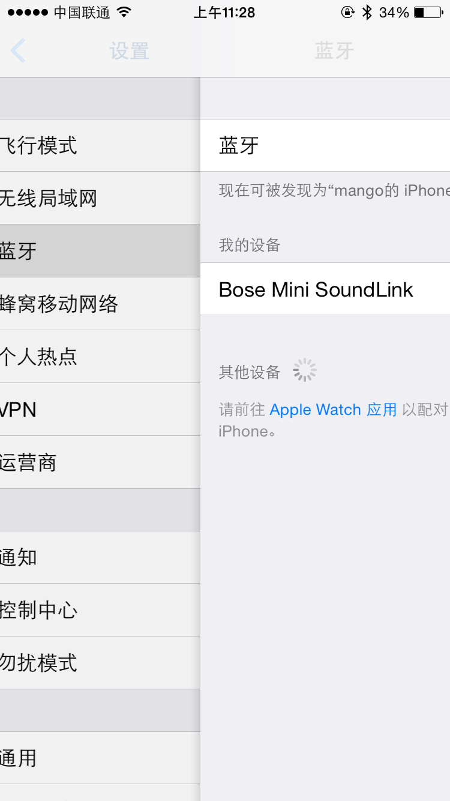

#2015 WWDC Best Practices

这篇文章主要记录观看学习2015 WWDC视频总结的iOS最佳实践。一个个session记录学习过于繁琐。因此决定用简单的篇幅,尽可能总结重点。

##Cocoa Touch Best Practices

1. App Lifecycle

	**如何使应用启动更快。**
	
	要点在于：
	> Return quickly from applicationDidFinishLaunching
	
	在applicationDidFinishLaunching不要花费时间进行读取数据等工作,尽快地返回。如果有必要的话,让它在后台执行,不阻塞主线程。
	
	例如：
	
	~~~swift
	func application(application: UIApplication, didFinishLaunchingWithOptionslaunchOptions: [NSObject: AnyObject]?) -> Bool {
    		globalDataStructure = MyCoolDataStructure()
		let globalQueue = dispatch_get_global_queue(DISPATCH_QUEUE_PRIORITY_DEFAULT, 0)
	    dispatch_async(globalQueue) {
        	globalDataStructure.fetchDataFromDatabase()
	    }
	    return true
	}
	~~~
	
2. Views and View Controllers

	**利用UIViewControllerTransitionCoordinator在UIViewController的转场动画中获取更精准的控制。**Session只简单地提了一下,没有展开。
	
	但是看到Session的这里,却引起了我的思考。让我想到了从iOS7开始,系统为UINavigationController添加了一个返回手势,只要我们在边缘用手势就能够返回。
	
	但是有时会遇到一种情况,那就是我们在`viewWillAppear`里面做了一些工作。而一旦用户在手势滑动的过程中如果中途取消了。那么我们`viewWillAppear`里面的工作已经被触发了,但是下一次用户再滑动返回,仍然会触发一次。
	
	举一个例子,直到我写下这篇总结时,苹果在其iOS的最新版本iOS8.4中仍然有的问题。
	
	那就是打开iOS设置界面,随便点一个比如蓝牙一栏进去,然后我们滑动返回,能看到有个美妙的cell从selected到deselected的过渡动画。但是注意,如果我们中途取消返回,第二次返回的时候,就没有这个效果了。
	
	
	
	原因就在于第一次`viewWillAppear`的时候已经取消了选择。
	
	这个问题我们就能通过`UIViewControllerTransitionCoordinator`来进行精确协调。
	
	官方的文档描述:
	> An object that adopts the UIViewControllerTransitionCoordinator protocol provides support for animations associated with a view controller transition. Typically, you do not adopt this protocol in your own classes. When you present or dismiss a view controller, UIKit creates a transition coordinator object automatically and assigns it to the view controller’s transitionCoordinator property. That transition coordinator object is ephemeral and lasts for the duration of the transition animation.

	也就是ViewController本身会提供一个这样的Coordinator来帮助我们精确定位转场动画的状态。
	
	上面的问题我们能够这样解决。重点在于检测到transition如果被取消的话,我们就恢复到原来的状态。除此之外我们还能够检测到过场的其他状态与属性。可以查阅[官方文档](https://developer.apple.com/library/ios/documentation/UIKit/Reference/UIViewControllerTransitionCoordinator_Protocol/)
	
	~~~swift
	  override func viewWillAppear(animated: Bool) {
		super.viewWillAppear(animated)

		if let indexPath = tableView.indexPathForSelectedRow{
		    tableView.deselectRowAtIndexPath(indexPath, animated: true)

		    transitionCoordinator()?.notifyWhenInteractionEndsUsingBlock({ context in
			if context.isCancelled(){
			    self.tableView.selectRowAtIndexPath(indexPath, animated: true, scrollPosition: UITableViewScrollPosition.None)
			}
		    })
		}
	    }
	~~~
	
	**Properties,not tags**
	
	避免使用`setTag:`和`viewWithTag:`
	
	因为可能会导致 
	- 与系统或是别人的tag冲突
	- 没有编译警告
	- 没有runtime errors
	
	其实我基本在工程里都没有用tag来标记View。一直都是使用property。所以没有注意到这个问题。看了这个Session之后也没有什么感觉。
	
	直到有一天我在一个有几十万行代码的项目中还看到了这样的代码：
	
	~~~objective-c
	cellSubViewTag++;
    	UILabel* someLabel = (UILabel*)[cell.contentView viewWithTag:cellSubViewTag];
    	if (someLabel == nil) {
	  someLabel = [[UILabel alloc] init];
          someLabel.tag = cellSubViewTag;
          [cell.contentView addSubview: someLabel];
	}
	cellSubViewTag++
	//继续add subView.........
	~~~
	
	我整个人都不好了。因为新添加的业务需要我去取出某个Label的值,如果使用property。我只需要cell.someLabel.text去取这个值就好。这个时候。我只能看着这样的代码流泪重构。所以请大家务必在开发中使用property引用SubView。爱人爱己,在这里就应该老老实实地继承TableViewCell,在里面进行布局,暴露出应该暴露的变量供别人使用。
	
	简单来说,就是不要因为便利而去牺牲可维护性,可扩展性和可阅读性。	

3. Table and Collection Views

	一个Cell高度变化动画的技巧。如果我们采用了AutoLayout只需四步即可。

   	1. tableView.beginUpdates 
   	2. Update model
   	3. Update cell contents
   	4. tableView.endUpdates

	
	
	
	
