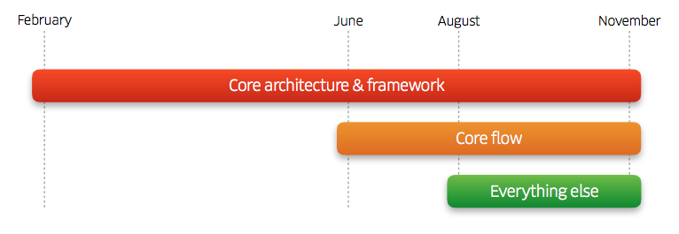

# 2017@Swift开发者大会体验

上个周末（5.13-5.14）在深圳参加了2017@Swift开发者大会。和大家分享一下这次的体验。

### 第一天

第一天的演讲清一色都是老外。

#### 1.Swift with hundreds of engineers

​	首先登场的是来自Uber 移动架构和框架组的负责人Tuomas。在这个分享中，Tuomas 介绍了如何在上百人的团队中使用 Swift 进行开发，并介绍 Uber 重写过程中遇到的各种问题和解决方法。

​	这个演讲对于考虑迁移开发语言至Swift的大公司非常有帮助。Tuomas首先介绍了迁移至Swift的目标和整体架构。最重要的目标是保证99.99%的稳定性。而最终实现后监测的结果，稳定性达到了99.97%（不Crash率）。Swift本身的语言特性极大程度地降低了Crash的可能。

​	Tuomas然后阐述了他们在实现超过1万个Swift文件，百万行Swift代码后对Swift的看法。

​	首先，优点很简单，就是Swift是一门更好的语言，更现代，更先进，更安全。然后对Swift在实际开发的缺点和对应的改进方式进行了探讨。首先最大的缺点是工具链的不成熟，Swift才诞生几年，Xcode到现在还会经常出现编译失败，语法高亮失败等各种问题。除了等待苹果解决之外，Uber的开发团队通过将多个Swift文件合并为一个文件，创建更多的framework来降低Xcode出错的概率。其次就是Swift有多个原因会增加包的大小，其中最让我感到惊奇的是，Swift的Structs类型会增加二进制文件的大小，因为Struct编译后的代码行数比Class类型更多。幸运的是，这些都是因为Swift诞生时间过短的原因，随着苹果对编译器的优化和Swfit ABI的稳定，包大小这个问题会得到解决。

​	最后，Tuomas介绍了他们使用的构建工具[Buck](https://github.com/facebook/buck)。

​	上图是Uber迁移过程的路线图。整个过程从二月份到十一月份，历时十个月。其中核心架构和框架的搭建是最早开始的。核心流程和UI界面等是将近半年后才开始开发。对于一个大项目，如果涉及到类似这种迁移语言的大工程。我们也应该先把基础框架彻底准备好后，再开始细节的动工。

​	

#### 2.Concurrency on iOS

​	第二场是来自英国的Sam Davies。他是RayWenderlich的CTO。他的演讲非常热情，准备也很充分。从基础的 NSOperation 到GCD的高级用法。还涉及线程安全等多线程问题。

​	这个演讲偏基础。会后我和Sam讨论了使用GCD实现读者写者锁的问题。因为时间有限，Sam没有在会场给出具体的回复。但是Sam非常敬业和Nice。我们通过邮件对问题进行了沟通。最后把问题得到了清晰的解决。

#### 3.iOS development efficiency at Facebook

​	第三场是由前 Facebook 资深开发者Igor Jerkovic带来的演讲。主要讨论了开发过程中，对代码提交的管理。在演讲中，他对比了使用feature分支和提交到单一分支这两种方式的优缺点。最后他建议提交到单一分支，搭配一个feature开关来控制。微信采取了feature分支这种形式。个人觉得feature分支这种形式更适用于迭代快，功能多，且需求经常变动的项目。

#### 4.From Zero to Hero: Making your iOS App Accessible to VoiceOver and Beyond

​	第一天下午的第一场是来自Chorus Fitness 的核心 iOS 开发，Sommer Panage。一位美女工程师。她深入地探讨苹果的Voice Over框架。通过一个demo展示了Voice Over的API和代码模式。

#### 5.Thinking in Rx way

​	接下来是由RxSwift 框架作者Krunoslav Zaher带来的演讲。他介绍了为什么要使用RxSwift，什么是一个Reactive的系统。同时用一个demo来展示了RxSwift的用法。

#### 6.JavaScript for Swift Developers

​	下午的第三场由CocoaPods、Realm 核心开发者Marius Rackwitz进行演讲。在他演讲前，他没有公布演讲主题。直到揭开后，在场观众分分表示我们中出了个叛徒。在演讲中，Marius对比了Swift和JavaScript的异同点，讲解了JavaScript的基础知识。

#### 7.ServerSideSwift		

​	下午的第四场由 Perfect ( Swift 服务器端框架 )  框架作者，CTO Kyle Jessup演讲。主要介绍了什么是Server Side Swift. 介绍了使用Swift编写服务器的workflow。然后介绍了Perfect这个框架基本构成。个人看好Swift在服务端的发展。Swift的安全性，快速很适合服务端的编码。

​	比如通过Perfect这个框架来处理URL*http://myserver/adduser?username=foo&password=bar*

~~~swift
var routes = Routes(baseUri: "/v1") routes.add(uri: "/adduser") {
request, response in
guard let userName = request.param(name: "username"), let password = request.param(name: "password") else { 
	response.status = .badRequest
	return response.completed()
}
// TODO: Create the user
response.completed() 
}
~~~

​	可以看到，上面的Routing, Handlers代码非常清晰。

#### 8.Building Confidence: Testing iOS applications

​	第一天的最后一场由流利说 iOS 工程师，MagicalRecord 作者Saul Mora。Saul 这次分享的是测试。阐述了为什么要测试。和如何通过`Quick` 测试框架进行测试。

### 第二天

#### 1.Swift 为什么这么快

​	第二天由唐巧负责开场。巧哥目前是小猿搜题这个产品的负责人。在这次的演讲中，巧哥介绍了Swift在性能上的优势和这些优势背后的原理。Swift在性能上的优化主要有编译器优化，内存优化，方法调用优化，引用计数优化等等。这次演讲主要探索了引用计数优化和Protocol类型的优化。并通过一个Demo,使用LLDB探索了Protocol类型的内存布局。

#### 2.学习 iOS 编译原理能做哪些有意思的事情

​	第二场由滴滴出行技术专家戴铭进行演讲。戴老师不仅写得一手好代码，还画得一手好画。这次演讲的PPT都是他亲手画出来的。在演讲中，戴老师首先展示了一个直接能够将Flex布局的H5代码，直接转换为Swift语言的Parser。然后介绍了LLVM后端，整个后端编译的详细流程，非常的深入。这次的演讲展示了编译原理的魅力。演讲后，我向戴老师了解到，开头的这个H5转OC,Swift的Parser是他正在编写的一个工具，有计划要开源。

#### 3.打造易扩展的高性能图片组件

​	第三场由腾讯 QZone 团队 iOS 开发柯灵杰进行演讲。柯灵杰清晰地从一个最基础的图片组件架构，逐步地添加功能，最终形成一个强大，扩展性强的图片组件。同时，还深入地探索了图片组件的优化，分别介绍了渲染性能优化，内存占用优化和缓存优化。有许多开创性的优化方法，非常值得一听。

#### 4.一个轻量级 FRP 框架的诞生记

​	下午的第一场由来自 UC 浏览器的资深工程师王文槿进行演讲。他也是SwiftGG翻译组的一员，我们都叫他莲叔。莲叔这次的演讲专注于探讨一个问题：Reactive思想能够解决很多问题  VS  Reactive技术栈陡峭的学习曲线。然后讨论了MVVM和Reactive的关系。MVVM其实和Reactive并没有直接的关系。但是Reactive里面的一些思想非常适合解决MVVM中，ViewModel的State和View绑定的问题。

​	接着莲叔用一个轻量级的Reactive实现证明了自己造一个轮子并不困难。同时我们可以只关心Reactive思想中我们想关注的部分。比如对于MVVM,我们可以专注于绑定的部分。

​	这个演讲解决了我关于MVVM和Reactive关系的疑问，干货十足，非常推荐。

#### 5.组件 + 组建 = 美团 iOS 客户端

​	接下来是美团点评高级工程师赵恩生带来的演讲。他主要讲了美团在组件化和组建集成的经验。美团通过cocoapods进行组件化，大大小小总共有300多个组件。因此组件的合入和发布流程成了一个问题。演讲主要针对组件的提交，合入，发布流程进行了介绍。同时还介绍了美团的发布调度系统。其中，美团的发布调度系统实现了很大的自动化，值得借鉴。

#### 6.Metal和DeepLeaning

​	下午第三场由ThoughtWorks 高级咨询师傅若愚进行研究。主要讲了Metal和机器学习的联系，和用Metal打造了一个将黑白图片转为彩色图片的Demo。biger很高, 不过因为我对机器学习的相关知识没有了解，因此只能初略地体验了一下机器学习的魅力。

#### 7.TensorFlow+iOS=❤️: 造一个颜文字输入法

​	紧接着的是由Google工程师尹航带来的演讲。同样和机器学习有关，TensorFlow是Google开源的一个机器学习框架。这次尹航通过TensorFlow在iOS实现了输入英文，自动生成相关的emoji表情。讲解有趣生动，连我这个机器学习的门外汉也能够学习到一些基础知识。

​	

#### 8.当 Swift 遇上树莓派

​	大会的最后一场演讲由礼物说联合创始人唐晓轩（糖炒小虾）负责。主要是以玩为主题。虾神分别用三个demo阐述了如何使用Swift和树莓派交互，接入温度传感器，实现自己的HomeKit设备。非常有趣好玩。

两天下来，我个人觉得有五个演讲非常精彩，值得学习：

1.Swift with hundreds of engineers 

2.Swift 为什么这么快

3.打造易扩展的高性能图片组件

4.一个轻量级 FRP 框架的诞生记

5.组件 + 组建 = 美团 iOS 客户端

演讲的PPT可以在[大会Github仓库](https://github.com/atConf/atswift-2017-resources) 下载。

### 总结

阮一峰之前在微博说过“互联网时代还要让几百个人，在一间屋子里呆坐一天，怎么看都是一种低效昂贵的交流方式”。 参加会议后，我认为这句话是错误的。经过了这两天的参会，我觉得如果把开发者大会纯粹作为一个学习的渠道，开发者大会肯定不够自己在家看书，看视频学习效率高。但是如果把大会看做一个人与人交流，接触业界前沿知识，认识一群和自己有着同样热爱的人们是非常非常值得的。这次参加大会，和许多以往只能在网上交流的大牛，SwiftGG小伙伴面基了，同时也学习到不少新知识，是一次非常愉快，踏实丰富的体验。

​	