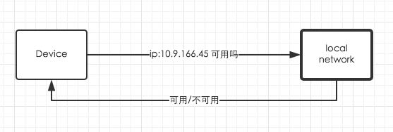
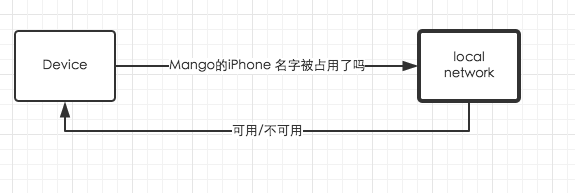
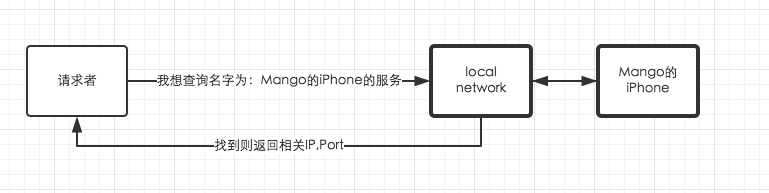
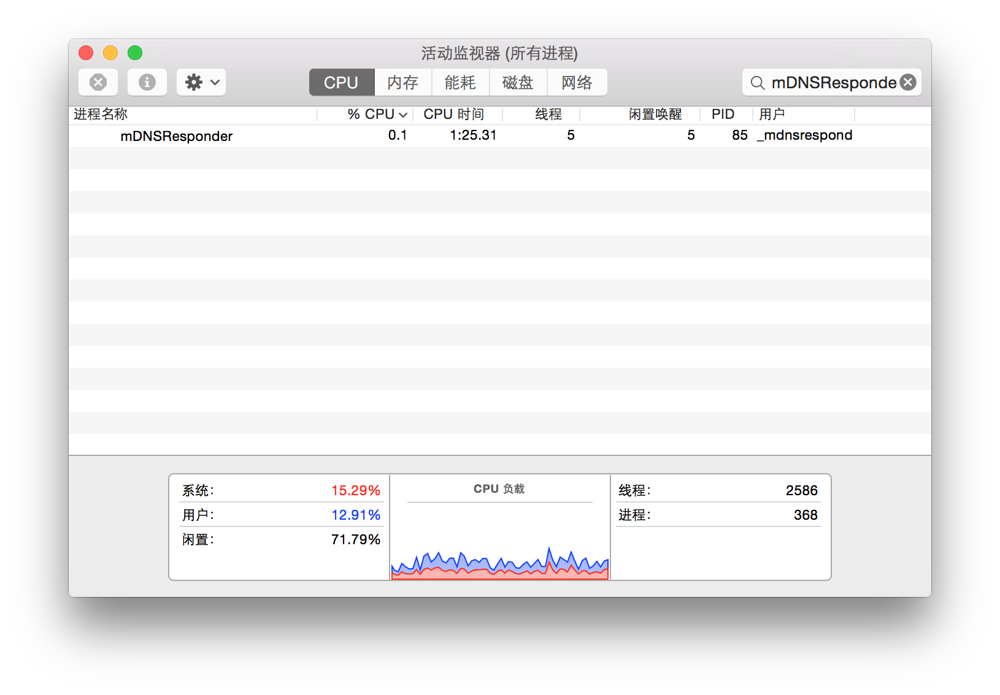
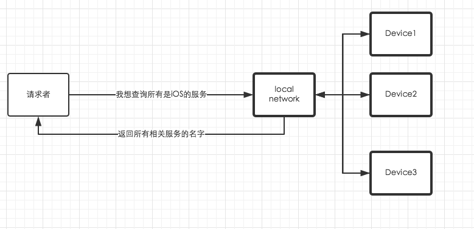
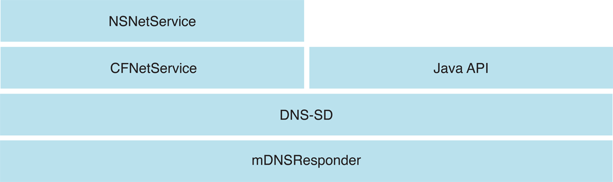
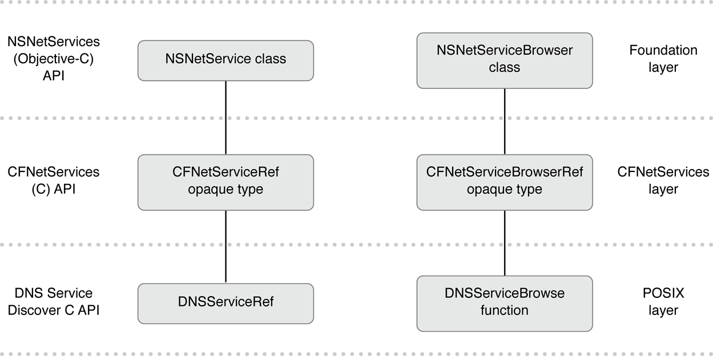
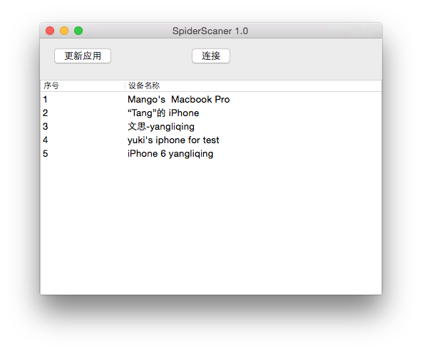

#Hello Bonjour!

--
###一开始用Bonjour,我是拒绝的。

让我们以一个问题开头：如何能在本地网络找到自己想要的硬件设备及相应服务,并连接？

在这个以IP协议进行通信的互联网世界,我们的计算机与移动设备都需要一个唯一IP作为标示。假如我们有一台打印机需要进行连接。我们必须给他分配一个固定的IP,我们才能够连接它。然后我们可能还需要去配置一个DNS服务器,这样子我们才不需要直接通过IP去连接打印机。
 
很多时候,我们希望可以在本地网络获得可用服务的列表,而不需要知道每个服务的IP地址,端口。但是我们不想去经过复杂繁琐的网络配置后才能直接获取本地网络在线的服务。

让我们来通过一个真实的项目来逐步探索。就以自己改造的`spider`,一个调试工具为例。

简单介绍一下项目对本地网络连接的需求：***我们需要电脑发现本地网络所有可供调试的iOS设备。***

那我们如何进行连接呢。

1. 首先我们想到的最简单的方法就是通过IP连接。

	OK,问题解决。打道回府啦。笑。
	
	`spider`刚开始的确是用这样的模式进行的。如果一个人的手机出现了问题,他需要首先在手机上找到IP,然后告诉调试人员。然后调试人员再在网页输入IP进行连接。
	
	作为一个有节操的程序员。我们意识到这不是一个优雅的方式。我们想有没有一种方法能够获取本地网络内需要调试的设备IP呢？
	
2. UDP广播。

	然后我们想到进行UDP广播,利用UDP广播我们能向同一本地网络所有设备发送一条消息,接收到信息后我们能够解析出发送方的端口和IP。我们就从这里开始着手吧。
	
	然后我们开始设计通信协议。为了简化。我们直接用NSString来传递信息,为了分辨出不同设备,于是附上了设备的名字。然后对于iOS Simulator。我们还要另外附上IP以供辨识。最后用NSTimer不断广播信息。在这里我们省略Socket等实现。只贴出发送信息的代码：
	
	~~~objective-c
	-(void) broadcast
{
    NSString *deviceName = [UIDevice currentDevice].name;
    if ([deviceName rangeOfString:@"Simulator"].location != NSNotFound ) {
        
        NSString *appendString = [NSString stringWithFormat:@" %@",[SSNetworkInfo currentIPAddress]];
        deviceName = [deviceName stringByAppendingString:appendString];
    }
    
    [self.m_broadcastSocket sendBroadcast:[deviceName dataUsingEncoding:NSUTF8StringEncoding]];
}
	~~~
	
	####局限：
	
	设备端的问题:
	
	1. 耗电问题。不断的UDP Broadcast 会耗费大量电源。

	2. 网络阻塞问题。因为UDP广播会对同一本地网络的所有Host都发送信息。过于密集的发送,有可能会造成网络的堵塞。

	3. 稳定性,UDP Socket可能会因为各种情况而中断。
	
	接着在电脑端。我们需要考虑的问题:
	
	1. 应用是否处于Active状态。我们不能检测处于Background,Inactive,Suspended状态的iOS程序。
	
	2. 设备离线,设备重启,应用重新编译等不可连接调试的情况。
	
	3. 电脑切换Wifi情况,我们只能检测处于同一网络的设备。

	4. 设备IP变化,因为设备的IP不是固定的,而是由DHCP服务器动态分配的。很有可能我们要连接的时候,设备的IP已经改变了。

	5. .....

	随着测试和不断改进,我们发现我们不断发现问题,不断增添新的代码。而且基于Socket实现,我们还要考虑网络的稳定性,Socket断开与重连等情况。而且由于UDP广播的间隔时间与不稳定性,导致我们获取设备的速度不快和稳定不足。一个简单的需求逐渐演化为一个小系统。
	
	于是我们想找一种简洁稳定的协议来替代UDP。Yes,最终我们需要的就是Bonjour。
	
	
##拥抱Bonjour

###什么是Bonjour?

bonjour来自法语,是你好的意思。一个很有意思的单词。

bonjour是苹果公司发布的一个基于ZEROCONF工作组(IETF下属小组)的工作,用于实现零配置网络联网的解决方案。Bonjour是基于IP层协议的。

大家不要被这些高大上的互联网标准小组,零配置网络这些名词吓到。通俗理解就是这些很棒的组织想要发明一个解决不需要复杂配置就能够让本地网络的设备互相发现彼此的一个方案。

为了实现零配置网络,需要解决三个需求。

1. 寻址(分配IP地址给主机）
2. 命名(使用名字而不是IP地址来代表主机）
3. 服务搜索（自动在网络搜索服务）

我们来看看Bonjour的三项主要功能能够如何解决我们的问题。

1. 寻址

	一个在网络中的设备需要有一个自己的IP。有了IP地址,我们才能基于IP协议进行通信。
	
	实现原理： Bonjour协议的寻址依赖于IP层协议。
	
	对于IPV6标准,IP协议已经包括了自动寻找IP地址的功能。但是目前仍然普遍使用的IPV4
不包含本地链路寻址功能。那么解决方案就是在本地网络选择一个随机的IP地址进行测试,如果已经被占用,则继续挑选另外一个地址。

	

2. 命名。

	我们不想通过冷冰冰的IP地址来作为我们服务的标志。我们想为我们的服务取一个名字。就像打印机一样,我们希望能在网络发现它的时候,是以一个比如“二楼的打印机”这样的标志,而不是一串冷冰冰“10.9.166.45”的IP地址。
	
	就像我们希望发现我们的需要调试的iOS设备的时候,能够知道它是“Mango's iPhone7”、因此,我们需要给我们的设备和服务命名。
	
	我们还希望能够通过名字找到服务准确的IP地址,就像在浏览器输入"www.qq.com"一样,DNS服务器会自动帮我导向正确的网站IP地址。
	
	而`Bonjour`,正是帮我们实现了命名和解析的功能。保证了我们服务的名字在本地网络是唯一的,并且把别人对我们名字的查询指向正确的IP地址和端口。
	
	实现原理：
	
	我们在这里抛开复杂的`RFC 6762`规范,用简洁的语言介绍一下原理。
	
	- 指定名字：
	
		用户在注册一个名字的时候,设备向本地网络发送查询来确定名字是否选中。如果用户提供的名字已经被使用,则Bonjour会自动重命名我们的服务。例如我们注册名字为"Mango's iPhone7"已经被使用,那么Bonjour可能会帮我们取"Mango's iPhone7-1"的名字。
		
		

		
	- 解析名字：

		如果有用户发出一个查询,说我想找名字叫"Mango's iPhone7"的设备,则本地网络收到请求的设备看看自己是不是被请求了,如果是的话,则返回正确的IP地址,端口。
		
		

	- responder
	
		需要了解的是而Bonjour在系统级别上添加了一个`mDNSResponder `服务来处理请求和发送回复,从系统级层面上处理,我们就无需在应用内自己监听和返回IP地址,只需到系统内注册服务即可。减少了我们应用的工作量和提高了稳定性。就好像`APNS`在iOS上帮助我们维持一个系统级别的长连接。
		
		如果我们打开OS X上的活动监视器,查看目前正在运行的进程,你会发现有mDNSResponder在运行：
		
		
	> PS: 你可能会好奇这些请求和解析是通过什么进行的,在这里为了避免加入过多底层网络细节导致混淆,我只会悄悄的告诉你,背后是通过`mDNS`协议来进行的。
	
3. 服务搜索

	我们还需要搜索网络上可用的设备和服务来查看可用的服务。Bonjour帮助我们,只需指定所需服务的类型即可收到本地网络上可用的设备列表。
	
	实现原理：	  
	
	设备在本地网络发出请求,说我需要"XXX"类型的服务,例如：我要打印机服务。所有打印机服务的设备回应自己的名字。
	
	

###bonjour减少功耗的原理：

在spider中,为了节能,我们每隔15s发送一次UDP广播,但其实还是严重耗费资源。

无需服务器的寻址,命名,服务搜索有可能会产生大量的网络流量。但是Bonjour采取了一些机制来降低零配置的开销。包括缓存、禁止重复响应，指数回退和服务公告。

1. 缓存（`Caching`）

	Bonjour通过缓存记录来防止主机请求那些已请求过的信息。例如，当一个主机请求一个打印服务的列表时,收到列表后,本地网络的主机都会缓存这个列表。下次本地网络中的一个主机需要打印服务列表时,不需要再次发起请求,因为它已经拥有这个列表的缓存。系统负责维护这个缓存。应用开发者不需要做任何事情来维护它。
	
2. 阻止重复响应(`Suppression of Duplicate Responses`)

	为了阻止重复响应相同的请求,我们的request会包含了一个已被查询过的服务的列表。例如，如果主机正在查询打印机，第一个request不包含任何已查询过的打印服务，接着我们得到12个打印服务的回复。下一次该主机查询打印服务时,因为我们已经知道哪些服务被请求过了,已经查询过的打印服务则不做响应。

	Bonjour还以另一种方式来组织重复响应。如果一个主机将要响应，但发现另一个主机已经响应了相同的信息，则主机会阻止它的响应。应用开发者同样不需要做任何事情来阻止重复响应,由Bonjour来进行管理。

3. 指数回退和服务公告(`Exponential Back-off and Service Announcement`)

	当主机浏览服务时，它不会不间断地发送查询来查看是否有新的服务。相反，主机会初始一个查询，后续会不断增加查询时间的间隔，如1s, 3s, 9s, 27s这样一个时长间隔，最后可能会长达1小时的间隔。

	但这不意味着等一个小时的间隔后再来查看新的服务。当在网络中启动一个服务时，它会使用几次回退算法（也就是类似查询,1s, 3s, 9s, 27s...这样的时间间隔）来主动通知它的存在。这样就将服务公告和搜索的网络流量保持在最小，而新的服务也会很快就知晓。

	在一个运行在已配置Bonjour的主机上的服务,在注册到mDNSResponder后台驻留程序时会自动发出公告。而运行在其它硬件上的服务，如打印机，需要使用指数回退算法来公告其存在，这样能充分利用Bonjour的优势。
	
	
	最后让我们来对比一下UDP Broadcast 与 Bonjour的实现相同服务的情况。
		
	
	| 对比项  | UDP Broadcast | Bonjour
	------------- | ------------- | ------------
	稳定性  | 弱  |  强
	耗电|多|少
	网络阻塞  | 有  |	无
	自动命名  |无  | 有
	适配动态IP变化 | 无  | 有
	缓存    | 无  |  有
	速度 | 慢  |	快
	实现难度 | 难  | 易
	维护难度 |难| 易
	

	
##使用Bonjour

说了这么多来龙去脉,让我们直接开始看看如何使用Bonjour:

首先我们看看Bonjour在Cocoa世界里的实现Stack:

API级别：

我们直接使用抽象最高级的`NSNetService`,`NSNetServiceBrowser`来解决问题。

`NSNetService`代表一个服务。`NSNetServiceBrowser`用于搜索服务。
  
    
      
        
        
Bonjour有三种最重要的操作。我们在这里以`spider`为例子选取最核心的步骤介绍。

1. 发布服务。

	在`spider`中,我们需要装有测试应用的设备被别人发现。因此我们需要注册发布到本地网络上：
	
	~~~objective-c
	      self.netService = [[NSNetService alloc]initWithDomain:@"local." type:@"_spider._tcp." name:@"" port:2333];
        self.netService.delegate = self;
        [self.netService publish];
	~~~
	
	我们来介绍一下几个重要的参数：
	- `domain` :设置service的domain,为了注册到本地网络,我们需要使用@".local"
	- `type`: 指定服务的类型,需要遵循这样的格式：_ServiceType._TransportProtocolName
	- `name`: 主机名,如果指定@"",系统会使用当前计算机的名字。
	- `port`: service运行的端口。
	

2. 搜索服务。

	在`spider`中,我们需要搜索提供测试的服务设备：
	
	~~~objective-c
	self.browser = [[NSNetServiceBrowser alloc]init];
	self.browser.delegate = self;
   [self.browser searchForServicesOfType:@"_spider._tcp." inDomain:@"local."];
	~~~
	
	我们只需指定服务类型与domain即可。
	
	如果`NSNetServiceBrowser `搜索到服务,则会通知delegate进行处理,我们在这里进行增删和更新UI。
	
	~~~objective-c
	
	- (void)netServiceBrowser:(NSNetServiceBrowser *)aNetServiceBrowser 	didFindService:(NSNetService *)aNetService moreComing:(BOOL)moreComing
	{
   	 	[self.services addObject:aNetService];
    
   	 	if (!moreComing) {
   	     [self.tableView reloadData];
   	 	} 
	}
	
	- (void)netServiceBrowser:(NSNetServiceBrowser *)aNetServiceBrowser didRemoveService:(NSNetService *)aNetService moreComing:(BOOL)moreComing
	{	
   	 	[self.services removeObject:aNetService];
	    if (!moreComing) {
   	     [self.tableView reloadData];
   		 }
	}
	~~~
	
	设置正确后,我们就能获得服务的列表。：

	
	
3. 解析

	获取service之后,我们并不能直接获取服务的IP地址,端口和hostName,这是因为随着时间改变,服务的地址可能会经常改变。因此我们在真正要连接服务的时候进行解析以获取正确信息。
	
	在`spider中`,我们选中设备后,需要获取设备的hostName以进行连接：
	
	~~~objective-c
	- (void)setService:(NSNetService *)service
	{
    _service = service;
    
    self.service.delegate = self;
    [self.service resolveWithTimeout:5];
	}    
	~~~
	
	解析完毕后,service会通知delegate:
	
	~~~objective-c
	- (void)netServiceDidResolveAddress:(NSNetService *)sender
	{
		//get service's hostName
		NSString *host = sender.hostName;
		
		//get address data 
		 NSData *address = sender.addresses.firstObject;
	}
	~~~
	
	根据不同应用,我们可能获取Service的IP,端口等提供给`Socket`, `NSURLConnection`,网页使用。这些信息都可以在解析后的service中取得。
	
	
	需要注意的是我们获取得到的addrees data是一个C 结构体,我们需要自己取出我们想要的IP地址
	
	这里给出一个获取IP地址方法给大家参考：
	
	~~~objective-c
	 (NSString*)IPFromData:(NSData*)data
	{
   	 struct sockaddr_in *addr = (struct sockaddr_in*)[data bytes];
   	 if (addr->sin_family == AF_INET) {
   	     NSString *ip = [NSString stringWithFormat:@"%s",inet_ntoa(addr-	>sin_addr)];
       return ip;
   	 }
   	 return @"no ip address";
	}

	
	~~~
	
##总结

我们从需求入手,逐步探索。最终学习Bonjour的原理和使用。Bonjour作为一个系统级别的解决方案,其思路与方案值得我们学习。以后遇到有类似的应用环境时,我们便可以想到我们可爱的Bonjour协议。

Hello,Bonjour!

参考文献:

[NSNetServices and CFNetServices Programming Guide](https://developer.apple.com/library/mac/documentation/Networking/Conceptual/NSNetServiceProgGuide/Introduction.html)

[Bonjour Overview](https://developer.apple.com/library/mac/documentation/Cocoa/Conceptual/NetServices/Introduction.html)

	
	

