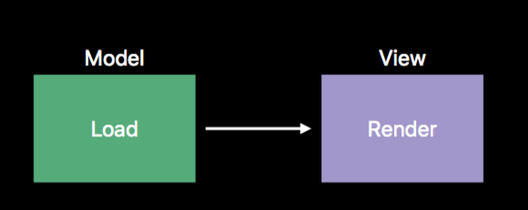
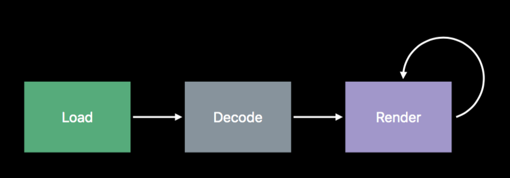
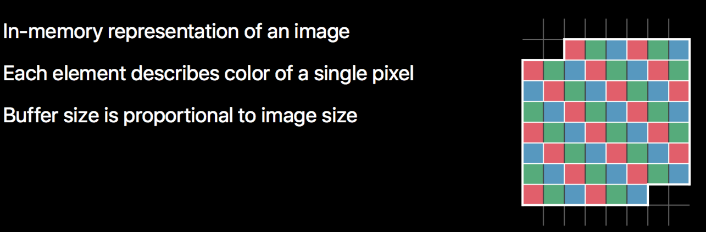
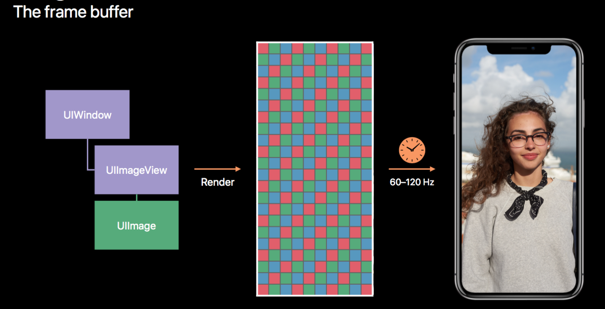
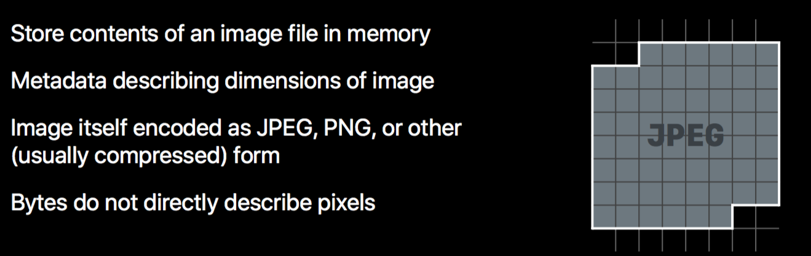
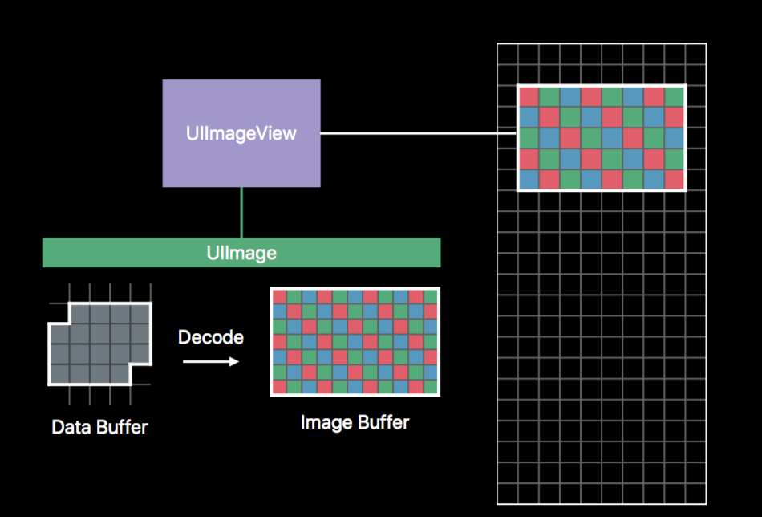
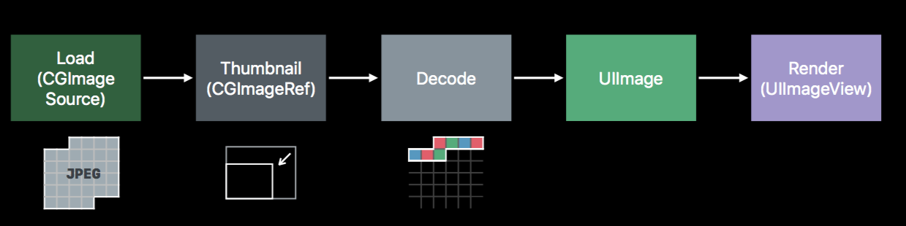

# 图像最佳实践 （Image and Graphics Best Practices）

Session: [WWDC2018 Image and Graphics Best Practices](https://developer.apple.com/videos/play/wwdc2018/219/)

这个 Session 主要介绍了图像渲染管线，缓存区，解码，图像来源，自定义绘制和离屏绘制。通过学习该 Session，能够对图像渲染流程有更清晰的认识，同时了解如何在开发中提高图像渲染的性能。

### 1. 图像渲染管线 （Image Rendering Pipeline)

从 MVC 架构的角度来说，`UIImage` 代表了 Model，`UIImageView` 代表了 View. 那么渲染的过程我们可以这样很简单的表示：

Model 负责加载数据，View 负责展示数据。

但实际上，渲染的流程还有一个很重要的步骤：解码（Decode）。

为了了解`Decode`，首先我们需要了解`Buffer`这个概念。

### 2. 缓冲区 （Buffers）

`Buffer` 在计算机科学中，通常被定义为一段连续的内存，作为某种元素的队列来使用。

下面让我们来了解几种不同类型的 Buffer。

`Image Buffers` 代表了图片（Image）在内存中的表示。每个元素代表一个像素点的颜色，Buffer 大小与图像大小成正比. 

`The frame buffer` 代表了一帧在内存中的表示。

`Data Buffers` 代表了图片文件（Image file）在内存中的表示。这是图片的元数据，不同格式的图片文件有不同的编码格式。`Data Buffers`不直接描述像素点。 因此，`Decode`这一流程的引入，正是为了将`Data Buffers`转换为真正代表像素点的`Image Buffer`

因此，图像渲染管线，实际上是像这样的：

### 3. 解码（Decoding）

将`Data Buffers` 解码到 `Image Buffers` 是一个CPU密集型的操作。同时它的大小是和与原始图像大小成比例，和 View 的大小无关。

想象一下，如果一个浏览照片的应用展示多张照片时，没有经过任何处理，就直接读取图片，然后来展示。那 Decode 时，将会占用极大的内存和 CPU。而我们展示的图片的 View 的大小，其实是完全用不到这么大的原始图像的。

如何解决这种问题呢？ 我们可以通过 `Downsampling` 来解决，也即是生成缩略图的方式。

我们可以通过这段代码来实现：

~~~swift
func downsample(imageAt imageURL: URL, to pointSize: CGSize, scale: CGFloat) -> UIImage {

	//生成CGImageSourceRef 时，不需要先解码。
	let imageSourceOptions = [kCGImageSourceShouldCache: false] as CFDictionary
	let imageSource = CGImageSourceCreateWithURL(imageURL as CFURL, imageSourceOptions)!
	let maxDimensionInPixels = max(pointSize.width, pointSize.height) * scale
	
	//kCGImageSourceShouldCacheImmediately 
	//在创建Thumbnail时直接解码，这样就把解码的时机控制在这个downsample的函数内
	let downsampleOptions = [kCGImageSourceCreateThumbnailFromImageAlways: true,
								 kCGImageSourceShouldCacheImmediately: true,
								 kCGImageSourceCreateThumbnailWithTransform: true,
								 kCGImageSourceThumbnailMaxPixelSize: maxDimensionInPixels] as CFDictionary
	//生成
	let downsampledImage = CGImageSourceCreateThumbnailAtIndex(imageSource, 0, downsampleOptions)!
	return UIImage(cgImage: downsampledImage)
}
~~~

通过`Downsampling`，我们成功地减低了内存的使用，但是解码同样会耗费大量的 CPU 资源。如果用户快速滑动界面，很有可能因为解码而造成卡顿。

解决办法：`Prefetching`  + `Background decoding`  

Prefetch 是 iOS10 之后加入到 TableView 和 CollectionView 的新技术。我们可以通过`tableView(_:prefetchRowsAt:)`这样的接口提前准备好数据。有兴趣的小伙伴可以搜一下相关知识。

至于`Background decoding`其实就是在子线程处理好解码的操作。

~~~swift 
let serialQueue = DispatchQueue(label: "Decode queue") func collectionView(_ collectionView: UICollectionView,
prefetchItemsAt indexPaths: [IndexPath]) {
	// Asynchronously decode and downsample every image we are about to show
	for indexPath in indexPaths {
		serialQueue.async {
			let downsampledImage = downsample(images[indexPath.row])
			DispatchQueue.main.async { self.update(at: indexPath, with: downsampledImage)
		}
	}
 }
~~~

值得注意的是，上面用了一条串行队列来处理，这是为了避免`Thread Explosion`。线程的切换是昂贵的，如果同时开十几，二十个线程来处理，会极大的拖慢处理速度。

### 4. 图片来源（Image Sources）

我们的照片主要有四类来源

1. Image Assets
2. Bundle，Framework 里面的图片
3. 在 Documents， Caches 目录下的图片
4. 网络下载的数据

苹果官方建议我们尽可能地使用 `Image Assets`, 因为苹果做了很多相关优化，比如缓存，每个设备只打包自己使用到的图片,从 iOS11 开始也支持了无损放大的矢量图。

### 5. 自定义绘制 （Custom Drawing）

只需要记住一个准则即可。除非万不得已，不要重载`drawRect`函数。

因为重载`drawRect`函数会导致系统给UIView创建一个`backing store`, 像素的数量是UIView大小乘以 contentsScale 的值。因此会耗费不少内存。

UIView 并不是一定需要一个`backing store`的，比如设置背景颜色就不需要（除非是 pattern colors）。如果需要设置复杂的背景颜色，可以直接通过 UIImageView 来实现。

### 6. 离屏绘制（Drawing Off-Screen）

如果我们想要自己创建`Image Buffers`, 我们通常会选择使用`UIGraphicsBeginImageContext()`, 而苹果的建议是使用`UIGraphicsImageRenderer`，因为它的性能更好，还支持广色域。

### 总结

这个 Session 的时长只有三十多分钟，因此主要从宏观角度为我们介绍了图像相关的知识。我们可以对它的每一个小章节都继续深挖。

对图形性能有兴趣的同学，可以更深入地学习 WWDC 2014的 《Advanced Graphics and Animations for iOS Apps》。之前编写的这篇[WWDC心得与延伸:iOS图形性能](https://github.com/100mango/zen/blob/master/WWDC%E5%BF%83%E5%BE%97%EF%BC%9AAdvanced%20Graphics%20and%20Animations%20for%20iOS%20Apps/Advanced%20Graphics%20and%20Animations%20for%20iOS%20Apps.md) 也是很好的学习资料。

