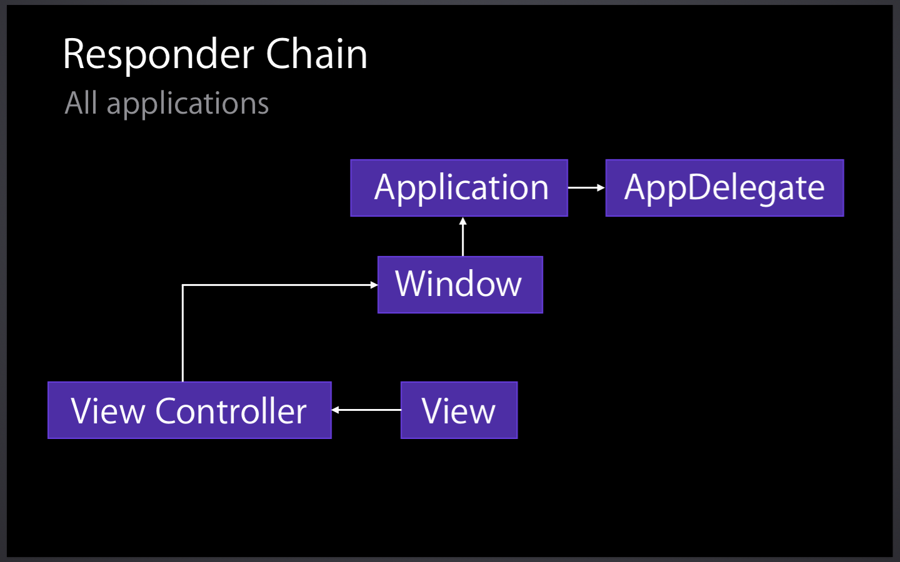

# WWDC 2014 
### Core iOS Application Architectural Patterns （session 224）

今年春节抽空看了几个WWDC session.分别简单总结一下。

这个Session主要讲了iOS框架使用的最常用的模式。Cocoa框架很多，但不需要担心学不过来，如果把基本模式了解了，会发现许多东西都是共通的。

该Session比较简单，复习和巩固了iOS的经典模式。

1. #### Target/Action  
   consistent way to connect controls to custom logic  
	
	无论Control是什么类，一个Button或是一个BarButtonItem,都是通过这种模式来将control与custom logic 连接起来。
	
2. #### Responder Chain  
   Handle events without knowledge of which object will be used
   
   
	Responder Chain最常见的应用便是处理Motion event.

	例如处理触摸事件,如果一个View无法处理，便上移给View Controller处理，不断往上。事件由一个Chain来处理，这样的做法有许多好处。我们不需要每个事件都指定特定的对象来处理，而是由一条线来处理，最终谁负责响应，是否需要响应由那个对象自己来决定。
	
3. #### Composite  
   Manipulate a group of objects as a single object
   
   想想View hierarchy,当移动SuperView时,subView也会跟着动。我们认为理所当然的东西，背后是有其机理的。
   
4. #### Delegation  
   Customize behavior without subclassing
   
   这个就不需要多说了，但是在已经有一些开发经验，有时候遇到一些问题，想用一些自以为hack，灵活的问题，往往有时是造成bug的原因。合理简洁地使用标准的模式，往往才能写出较健壮与适合团队协作的代码。
   
5. #### Data Source  
  Customize data retrieval without subclassing
  
  本质与Delegation一样。
  
6. #### Model-View-Controller  
   Provide organizational structure to focus responsibilities
   
   也是老生长谈的问题了。合理地划分职责，进行清晰的架构。
   
   
#### 这个Session偏基础，但是不无价值，让我重新温习了一些Cocoa的基本模式。对其认识更清晰。
