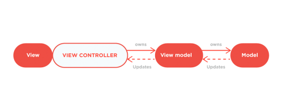

#Thinking in Swift

从Objective-C到Swift,我们往往脑袋里还带着旧的一套编程套路。为了利用Swift写出更优雅,更健壮的代码。让我们用初心者的心态来学习新的编程范式,新的可能。

目录：

- [1.拥抱Optional,远离Crash](#1)
- [2.学习泛型。抽象的魅力。](#2)
- [3.Protocol Oriented Programming 与Value Types](#3)

<h2 id="1">1.拥抱Optional,远离Crash</h2>

Swift引进了一个新的概念`Optional`,以及相关的一系列语法:
	
- `?` 与 `!` &nbsp;&nbsp;&nbsp;&nbsp;&nbsp;&nbsp;&nbsp;&nbsp;&nbsp;&nbsp;&nbsp;&nbsp;&nbsp;&nbsp; 声明可选类型
- `if let`   &nbsp;&nbsp;&nbsp;&nbsp;&nbsp;&nbsp;&nbsp;&nbsp;&nbsp;&nbsp;&nbsp;&nbsp;&nbsp;&nbsp;&nbsp;  可选绑定（Optional binding）
- `guard`    &nbsp;&nbsp;&nbsp;&nbsp;&nbsp;&nbsp;&nbsp;&nbsp;&nbsp;&nbsp;&nbsp;&nbsp;&nbsp;&nbsp;&nbsp;&nbsp;&nbsp;  提前退出（Early Exit）
- `as?` 与 `as!` &nbsp;&nbsp;&nbsp;&nbsp;&nbsp; 向下转型（Downcasting）
- `??`  &nbsp;&nbsp;&nbsp;&nbsp;&nbsp;&nbsp;&nbsp;&nbsp;&nbsp;&nbsp; &nbsp;&nbsp;&nbsp;&nbsp;&nbsp; &nbsp;&nbsp;&nbsp;&nbsp;&nbsp;&nbsp; 空合运算符(Nil Coalescing Operator)

####什么是可选（`Optional`）类型？  
可选类型代表的概念是要么这里有一个值,要么这里什么都没有。

实际上,`Optional`是一个枚举类型。Swift开源后,我们能看到Optional的实现

~~~swift
public enum Optional<Wrapped> : NilLiteralConvertible {
  case None
  case Some(Wrapped)

  public init() { self = .None }
  public init(_ some: Wrapped) { self = .Some(some) }
}
~~~

声明一个Optional的语法:

~~~swift
var strValue: String?   //?相当于下面这种写法的语法糖
var strValue: Optional<String>
~~~

因此声明一个Optional类型,实际上是声明一个枚举类型,这个枚举类型包括两种情况,一个是None,另一个是你声明的类型。

正因如此,我们在使用可选类型时,需要先判定这个Optional是属于哪种case。这个时候就需要用到可选绑定（Optional binding）这个语法来unwarp,然后再使用。

~~~swift
var strValue:String?
if let str = strValue {
    print(str)
}
~~~

####为什么需要可选类型？

> Optionals are an example of the fact that Swift is a type safe language.  ———《The Swift Programming Language》

基本上所有语言（C，C++，Objective-C,C#...）的类型系统都包括`Null`这个概念,但都没有相应正确的处理机制。连创建这个概念的Tony Hoare也把这个错误称为[billion dollar mistake](http://www.infoq.com/presentations/Null-References-The-Billion-Dollar-Mistake-Tony-Hoare)。因为它导致的编程错误累计起来造成了极大的损失。

比如在Objective-C中,虽然在OC中对空对象发送消息不会导致crash。**但是有许多情况下对空对象操作会导致Crash,比如向数组插入空对象等许多操作操作。**（详情查阅:[Crash in Cocoa](https://github.com/100mango/zen/blob/master/iOS%E5%A4%AF%E5%AE%9E%EF%BC%9ACrash%20in%20Cocoa/Crash%20in%20Cocoa.md)）

如果一个用户量巨大的应用出现了相关的Bug,的确会造成不少直接经济损失,而Debug等流程也意味着时间成本的支出。而Swift的`Optional`机制正是要避免`Null`这个概念所导致的错误。

Swift处理空值的理念就是: 一个值要么有值,要么就是optional类型。而optional类型要么有值,要么没有值,对optional类型操作前一定要判断有值之后才能操作,如果没有判断,则编译器会报错。
	
在Swift的世界里,如果我们不声明一个对象为Optional,则它一定是有值的。这一点是非常有价值的,避免了我们对空对象进行操作。

更重要的是,我们更希望达到一种状态,就是我操作对象和数据的时候,我能够确信它不为空。这种哲学避免了许多冗杂无用的判断Nil操作,同时也大大减少了忘记判断nil导致的crash。

####如何使用可选类型？
	
那Swift究竟通过什么途径来保证一个对象如果不是Optional,他就一定有值呢？
	
1. 如果我们使用了没被初始化的变量和常量,编译器会抛出error。
	
	~~~swift
	var testString:String
	print(testString)
	//error: variable 'testString' used before being initialized
	~~~
	
2. 类和结构体的实例在创建时,一定要为所有存储型属性设置初始值。我们可以在`initializer`或是声明属性的时候为其设置默认值,否则编译器会抛出error.
		
	~~~swift
	//error:return from initializer without initializing all stored properties
	class testClass {
    var a:String
	    init(){ 
	    }
	}
	
	//pass
	class testClass {
    var a:String = ""
    init(){}
	}
	
	//pass
	class testClass {
    var a:String
    init(){
        self.a = ""
    }}
	~~~

那我们如何在Swift中使用Optional呢？

- `?` 与 `!` &nbsp;&nbsp;&nbsp;&nbsp;&nbsp;&nbsp;&nbsp;&nbsp;&nbsp;&nbsp;&nbsp;&nbsp;&nbsp;&nbsp; 声明可选类型
	
	~~~swift
	var optionalInt:Int?
	~~~
	
	首先,在Objective-C中,nil仅针对对象,对于结构体,枚举类型等类型来说,是没有nil的。我们不能直接判断它们是否有值。在OC中,nil是一个指向不存在对象的指针,在Swift中,nil不是指针,它是一个确定的值,用来表示值为空。 (正如前面的Optional源代码所示,它是一个枚举值)  
	
	Swift的Optional让我们能明确地标注一个值有没有可能为空。并且值的类型没有限制。  
	 
	
- `if let`   &nbsp;&nbsp;&nbsp;&nbsp;&nbsp;&nbsp;&nbsp;&nbsp;&nbsp;&nbsp;&nbsp;&nbsp;&nbsp;&nbsp;&nbsp;  可选绑定（Optional binding）

	Swift的`Optional Binding`机制确保我们在使用Optional值时先判断值是否为空。
	
	在Objective-C中,判空操作不是强制和必须的。判空是一个良好的习惯,但是因为没有约束和规范。很多时候判空操作都被遗漏了,导致了许多潜在的问题。
		
	但在Swift中,我们在使用一个Optional值之前必须先unwarp它。
		
	语法：
		
	~~~swift
	if let constant = someOptional {
	  //use constant
	}
	~~~
	 
	  
- `guard`    &nbsp;&nbsp;&nbsp;&nbsp;&nbsp;&nbsp;&nbsp;&nbsp;&nbsp;&nbsp;&nbsp;&nbsp;&nbsp;&nbsp;&nbsp;&nbsp;&nbsp;  提前退出（Early Exit）

	在编程规范中有个名字好听的`黄金大道（Golden Path）`的准则。
	
	就是我们在编程的过程中使用条件语句时,代码的左边应该是一条Golden Path。也就是避免过多的`if`嵌套,可以合理地通过return提前退出。
	
	也就是:
	
	~~~swift
	//推荐：
	func someMethod() {
 	 if someBoolValue == false {
 	 	return
     }
    // Do something important
	}
	~~~
	
	~~~swift
	//不推荐
	func someMethod() {
 	 if someBoolValue == true {
   	 	// Do something important
  	 }
	}
	~~~
	
	而Swift中,我们可以用Guard来提前退出,且对Optional进行unwarp的操作。
	
	~~~swift
	guard let constant = someOptional else {
		return
	}
	//可以直接操作constant
	~~~
	
	考虑我们用if来操作
	
	~~~swift
	if someOptional == nil {
		return
	}
	//仍然需要unwrap optional
	~~~
	
	在这里用if，首先是语义上面不够清晰，通常我们使用if是想检查我们想要的情况，但在这里变成检查我们不想要的情况，然后提前退出。其次是检查过后，我们仍然需要去unwrap optional。
	
	而使用guard,语义更清晰，关键词`gurad`就是专门用于提前退出，并且能够在检查的过程中unwarp optional，并在后面的流程中使用。
	 
	
- `as?` 与 `as!` &nbsp;&nbsp;&nbsp;&nbsp;&nbsp; 向下转型（Downcasting）
	
	~~~swift
	if let subclassObject = superclassObject as? subclass {
    } 
	~~~
	 
	
- `??`  &nbsp;&nbsp;&nbsp;&nbsp;&nbsp;&nbsp;&nbsp;&nbsp;&nbsp;&nbsp; &nbsp;&nbsp;&nbsp;&nbsp;&nbsp; &nbsp;&nbsp;&nbsp;&nbsp;&nbsp;&nbsp; 空合运算符(Nil Coalescing Operator)
	
	空合运算符是对三目运算符其中一个用例的简化，相当于：
	
	~~~swift
	a != nil ? a! : b
	~~~
	
	空合运算法提供了一种更优雅的语法来表示判空,unwarp和提供新选项三者的结合。
	
	~~~swift
	var optionalName: String?
	let defaultName = "Mango"
	var name = optionalName ?? defaultName
	//相当于
	var name = optionlName != nil ? optionlName! : defaultName
	~~~
	

	

 参考:   
[why use optional let](http://stackoverflow.com/questions/29662836/swift-use-of-optional-with-let)

[Optional源代码](https://github.com/apple/swift/blob/master/stdlib/public/core/Optional.swift)

[Swift之 ? 和 !](http://joeyio.com/ios/2014/06/04/swift---/)

[Swift Guard Statement](http://ericcerney.com/swift-guard-statement/)

[编程的智慧](http://www.yinwang.org/blog-cn/2015/11/21/programming-philosophy)

<h2 id="2">2.学习泛型。抽象的魅力。</h2>

泛型编程,简单地总结。就是让我们在保持type safety的同时写出不局限于单一类型的代码,也即灵活与安全。

###泛型函数(`Generic Functions`)：

举个最简单的例子：交换。对比以下两种写法,一种是只针对Int类型的交换。而我们用泛型改写后,适用于其它所有类型。

~~~swift
func oldSwap(inout a:Int ,inout _ b:Int){
    let temp = a
    a = b
    b = temp
}

func genericSwap<T>(inout a:T,inout _ b:T){
    let temp = a
    a = b
    b = temp
}
~~~

泛型在提供灵活抽象的同时,也保持了类型安全,占位类型`T`代表了一种类型,使得交换限制在同种类型上,比如我们尝试交换数字和字符串swap(1,"2"),那么编译器就会报错。

###泛型类型(`Generic Types`)：

Swift也允许我们自定义自己的泛型类型,像Swift标准库提供的Array,Dictionary都是泛型类型。

泛型类型一般是容器类型,利用好它,我们能创造出灵活通用的类型。

这里举一个简单但却强大的例子:

在MVVM模式里,有个很重要的核心内容就是如何将ViewModel里的变化传递给View进行更新,苹果官方在iOS上没有提供一个绑定机制,我们可以使用delegate,KVO,Notification等系统途径来通知View进行更新,但很多时候都显得非常繁琐。

在这里我们简单地造一个绑定工具。

~~~swift
class DynamicString {
  typealias Listener = String -> Void
  var listener: Listener?

  func bind(listener: Listener?) {
    self.listener = listener
  }

  var value: String {
    didSet {
      listener?(value)
    }
  }

  init(_ v: String) {
    value = v
  }
}
~~~

上面这段代码很简单,利用了Swift的property observer,在每次Model设置的时候,调用闭包,我们可以在闭包里面做视图的更新,用起来像是这样：

~~~swift
let nameModel = DynamicString("Mango")
let nameLabel = UILabel()

nameModel.bind{ nameLabel.text = $0 }
nameModel.value = "100Mango"  //修改model的值
print(nameLabel.text) // 输出 "100mango" , UI的值得到了更新
~~~

我们很快就能够发现问题所在,对于一个String类型,我们要创造一个DynamicString。那么Int,NSdate...等等各种类型呢？

这个时候我们便可以利用Swift的泛型类型进行改造:

~~~swift
class Dynamic<T> {
  typealias Listener = T -> Void
  var listener: Listener?

  func bind(listener: Listener?) {
    self.listener = listener
  }
  
  var value: T {
    didSet {
      listener?(value)
    }
  }

  init(_ v: T) {
    value = v
  }
}
~~~

通过上面我们的改造,我们的简单绑定机制就能对各种类型的数据都起作用。

~~~swift
let text = Dynamic("Steve")
let bool = Dynamic(false)
let Int =  Dynamic(1)
~~~

参考引用:[bindings-generics-swift-and-mvvm](http://rasic.info/bindings-generics-swift-and-mvvm/)

###类型约束（`Type Constraints`）:

我们上面的泛型函数**inout**和泛型类型**Dynamic**能够应用到任何类型中。但是有时候,对泛型函数和泛型方法应用的类型进行约束,会非常的有用。

类型约束可以指定一个类型参数(`Type Parameters`)继承自指定类,或者遵循某个协议或一系列协议。

语法:

~~~swift
func someFunction<T: SomeClass, U: SomeProtocol>(someT: T, someU: U) {
}
~~~

- 泛型函数的类型约束：

比如我们要自己写一个方法找出数组中最大的元素 
> Swift2:已引入了`maxElement`方法 :)

~~~swift
func findLargestInArray<T : Comparable>(array: Array<T>) -> T? {
    
    guard array.count > 0 else{
        return nil
    }
    
    var largest : T = array[0]
    for i in 1..<array.count {
        largest = array[i] > largest ? array[i] : largest
    }
    return largest
}
~~~

注意到这里我们标注了`T : Comparable`,这是因为只有遵循Comparable协议的类型才能够进行比较,如果我们在这里没有进行类型约束,则直接会编译不通过,因为不是所有类型都能进行大小的比较。类型约束在这里让我们的泛型方法变得更安全和更有针对性。

- 泛型类型的类型约束：

比如Swift的字典的定义:

~~~swift
struct Dictionary<Key : Hashable, Value>
~~~

我们看到Dictionary的Key被约束为遵循`Hashable`协议。学过数据结构的我们知道,字典实际上是一个哈希表`hash table`。字典的键需要遵循`Hashable`协议,否则我们不能得到哈希表相关的插入,查找等特性。因此`Dictionary`这个泛型类型,需要通过类型约束来限制它的类型参数`Key`遵循`Hashable`协议。

###关联类型（`Associated Types`）:

我们在上面看到了在函数和类型中的泛型编程,而`Protocol`作为Swift中重要的组成部分,自然也是支持泛型这个编程概念的。

~~~swift
protocol Container {
    associatedtype ItemType
    mutating func append(item: ItemType)
}
~~~

假设我们定义了一个Container协议,我们希望遵循我们协议的类型能够实现一个添加新元素的功能。我们希望这个协议是广泛使用的,不限制元素的类型。这里我们通过`associatedtype`这个关键词来声明关联类型。等到实现协议的时候再去确定真正的类型。

~~~swift
class myContainer:Container{
    associatedtype ItemType = String
    func append(item: String) {
    }
}
~~~

我们简单地实现了一个遵循Container协议的类,我们确定了类型是String。在这里

~~~swift
associatedtype ItemType = String
~~~

这一句代码是可以不写的,Swift的类型推导系统能够在`append`方法的参数类型里获得ItemType的具体类型。

> [Swift2.2 关联类型的声明语法将改为`associatedtype `](https://github.com/apple/swift-evolution/blob/master/proposals/0011-replace-typealias-associated.md)

- 强大的`where`语句

	在上面我们可以通过类型约束(Type Constraints)来对泛型函数和泛型类型的类型参数进行约束。那么我们如何对关联类型进行约束呢？
	
	语法：
	
	~~~swift
	func allItemsMatch<C1: Container, C2: Container
    where C1.ItemType == C2.ItemType, C1.ItemType: Equatable>
    (someContainer: C1, anotherContainer: C2) -> Bool {
 		// 检查两个容器含有相同数量的元素
        if someContainer.count != anotherContainer.count {
            return false
        }
        // 检查每一对元素是否相等
        for i in 0..<someContainer.count {
            if someContainer[i] != anotherContainer[i] {
                return false
            }
        }
        // 所有元素都匹配，返回 true
        return true
	}
	~~~
	
	我们通过`where`语句来声明限制关联类型的语句,我们在类型参数列表后面加where子句。
	
	在上面的例子中,我们实现一个函数来确保两个遵循`Container`协议的类型包含的元素顺序和内容全部相同。
	
	~~~swift
	where C1.ItemType == C2.ItemType, C1.ItemType: Equatable
	~~~
	
	我们通过where子句限制了比较的两者的关联类型`ItemType`必须是相同类型,且是能够比较的。
	
	- Constrained Extensions

		我们还能够使用where子句在编写扩展的时候对泛型进行限制:
		
		1. 扩展泛型类型时,对类型参数进行限制。
		2. 扩展协议时,对关联类型进行限制。
		
		灵活地运用这个特性能够编写出很多实用巧妙的扩展。
		
		比如我们扩展泛型类型：
		
		~~~swift
		protocol CGPointWrapper {
		    var point : CGPoint { get }
		}
		
		extension CGPoint : CGPointWrapper {
		    var point : CGPoint {
		        return self
		    }
		}
		
		extension Array where Element : CGPointWrapper {
		    var path : CGPathRef {
		        let bezier = UIBezierPath()
		        
		        if self.count > 0 {
		            bezier.moveToPoint(self[0].point)
		        }
		        
		        for point in self{
		            bezier.addLineToPoint(point.point)
		        }
		        
		        return bezier.CGPath
		    }
		}
		~~~
		
		上面这个例子中,我们限制了Array的类型参数`Element`必须遵循`CGPointWrapper`协议。因为类型参数的限制目前只能限制是某个类或是遵循某个协议,而`CGPoint`是值类型,因此我们用`CGPointWrapper`协议替代,用于提供一个`point`属性以供使用。然后我们在扩展中取出`CGPoint`,直接合成`CGPathRef`,非常的优雅方便,并且是类型安全的。
		
		又比如我们扩展协议:
		
		~~~swift
		extension CollectionType where Self.Generator.Element : Comparable {
		    func largestElement() -> Self.Generator.Element?{
		        guard self.count > 0 else {
		            return nil
		        }
		        
		        var largest = self.first
		        for element in self{
		            if largest < element {
		                largest = element
		            }
		        }
		        return largest
		    }
		}
		~~~
		
		在这里我们扩展了`CollectionType`协议,实现了类似我们上面的泛型方法	`findLargestInArray`的类似功能,但不同的是我们的使用范围更广了,所有遵循	`CollectionType`的类型都能够获得这样的功能,而Array也是遵循`CollectionType`协议的。
	
  
 

参考引用: 

[swift-generics-pt-2](http://austinzheng.com/2015/09/29/swift-generics-pt-2/)

[The Swift Programming Language](https://developer.apple.com/library/ios/documentation/Swift/Conceptual/Swift_Programming_Language/Generics.html#//apple_ref/doc/uid/TP40014097-CH26-ID179)

[swift-type-constrained-extensions-express-yourself](http://www.cimgf.com/2015/12/14/swift-type-constrained-extensions-express-yourself/)

<h2 id="3">3.Protocol Oriented Programming 与value types</h2>

protocol-oriented programming 的核心在于

1. 用组合替代继承。
2. 

protocol extension 能够解决一些继承带来的问题。

**prefer composition over inheritance**

1. 庞大的基类

	[mixins-and-traits-in-swift-2](http://matthijshollemans.com/2015/07/22/mixins-and-traits-in-swift-2/)

2. 非常深的继承树

3. 类只能继承一个父类,多重继承有弊病。

   [Multiple Inheritance vs. Traits or Protocol Extensions](https://www.dzombak.com/blog/2015/06/Multiple-Inheritance-vs--Traits-or-Protocol-Extensions.html)

4. Protocol Extension 独特的优势：各种Value Type 和 Class 都能使用 Protocol Extension。并且能够对 protocol extension 进行Constraint。
	
	[Is there a difference between Swift 2.0 protocol extensions and Java/C# abstract classes?](http://stackoverflow.com/questions/30943209/is-there-a-difference-between-swift-2-0-protocol-extensions-and-java-c-abstract)
	
	Swift就使用了Protocol Extension来改进自己的标准库。
	
	例如在Swift1.2， `map`这个高阶函数是通过`Extension`实现的。因此每个`CollectionType`都需要自己实现一遍这些方法。
	
	~~~swift
	// Swift 1.2
	extension Array : _ArrayType {
	  func map<U>(transform: (T) -> U) -> [U]
	}
	~~~
	
	而通过在Swift2开始引入的 Protocol Extension， 直接扩展了`CollectionType`Protocol,提供了默认实现。这样子所有遵循`CollectionType`的类型都拥有了`map`，不需要一个个单独实现。
	
	~~~swift
	extension CollectionType {
    public func map<T>(@noescape transform: (Self.Generator.Element) throws -> T) rethrows -> [T]
	~~~
	

参考资料：

[introducing-protocol-oriented-programming-in-swift-2](https://www.raywenderlich.com/109156/introducing-protocol-oriented-programming-in-swift-2)

<h2 id="4">4.函数式编程（Functional Programming）</h2>

高阶函数

reduce,filter,map,flapmap,forEach

~~~swift
  var bubbleModels = [BubbleModel]()
   for bubble in bubbles {
   		bubbleModels.append(bubble.bubbleModel)
   }
   return bubbleModels
//高阶函数        
bubbleModels = bubbles.map({ $0.bubbleModel })
~~~

~~~swift
  var bubbles = [BubbleView]()
   for view in self.subviews {
	   	if let bubbleView = view as? BubbleView {
	   		bubbles.append(bubbleView)
	   	}
   	}

//高阶函数
bubbles = self.subviews.flatMap({ $0 as? BubbleView })
~~~

~~~swift
let detector = CIDetector(ofType: CIDetectorTypeFace, context: context, options: [CIDetectorAccuracy: CIDetectorAccuracyHigh])
let faces = detector.featuresInImage(image)

//循环版本
var maskImage: CIImage?
for face in faces {
    let parameters = //...获取脸部位置，构造滤镜参数
    let radialGradient = CIFilter(name: "CIRadialGradient", withInputParameters: parameters)
    if let circleImage = radialGradient?.outputImage {
        if let oldMaskImage = maskImage {
            maskImage = sourceOver(circleImage)(oldMaskImage)
        }else{
            maskImage = circleImage
        }
    }
}

//高阶函数
let mask = faces.flatMap({ face in
    let parameters = //...
    let radialGradient = CIFilter(name: "CIRadialGradient", withInputParameters: parameters)
    return radialGradient?.outputImage
}).reduce(CIImage(), combine: { sourceOver($0)($1) })

~~~

//内部实现
[map](https://github.com/apple/swift/blob/master/stdlib/public/core/Collection.swift)
[reduce,flatmap](https://github.com/apple/swift/blob/master/stdlib/public/core/SequenceAlgorithms.swift.gyb)