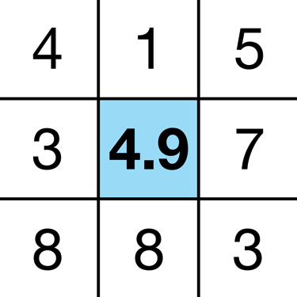

#WWDC2014
###Advanced Graphics and Animations for iOS Apps(session 419)
--
目录：  

- [Core Animation Pipeline](#CoreAnimationPipeline)

- [UIBlurEffectView](#UIBlurEffectView)

- [图形性能](#图形性能)

- [测试工具](#测试工具)

###一. Core Animation Pipeline

第一部分主要讲解了Core Animation的工作流程和渲染过程。

CoreAnimation的渲染流程可以用下图来概括:

在GPU的渲染过程中,我们能看到顶点着色器与像素着色器参与到图像的处理。

在objc.io中有一篇文章进一步地阐明了顶点着色器与像素着色器
([GPU 加速下的图像处理](http://objccn.io/issue-21-7/))

###二. UIBlurEffectView

第二部分主要讲解了iOS8新引入的UIBlurEffectView,结合第一部分来阐述UIBlurEffectView是如何工作的,以及它们的性能。

事实上,个人觉得有一点很有趣。就是UIBlurEffect为了优化图像处理效率,并不是用普通的模糊算法过程。虽然Session中没提到模糊算法,我在这里简单地介绍一下简单的模糊算法。

最简单模糊的过程即是用中心像素与其周围像素的颜色算术平均值来代表模糊后的颜色值。我们可以在下面两幅图看到中心像素值的变化。

原始图像       |  中心像素模糊化
------------- | -------------
    | 

那么苹果是怎么做的呢？最有趣的一点是它并不是对原始图像直接模糊,而是先将图像缩放之后再进行模糊。这样的优点就是模糊算法需要处理的像素点就减少了,处理的效率会更快。

看到这里的时候我是笑了的,哈哈,觉得很机智。适当的把思维跳出来,"偷点懒",有时真的会取得很不错的效果。学习,学习。

其次就是水平模糊与竖直模糊后再合成,添加颜色。

最后需要关注和有趣的一点是:苹果为我们提供了三个UIBlurEffect styles,   
分别为Extra light, Light, Dark.但是三者的耗费的资源各为不同。

Extra light耗费最多资源, Light其次, Dark最多。

我在自己的个人项目里也有用到UIBlurEffectView来美好,优化用户体验。两个项目都已经上架,并完整开源。欢迎去看看。

- [TouchColor](https://github.com/100mango/ColorPicker) 

	主要使用在主菜单界面。
	
- [QR Catcher](https://github.com/100mango/QRCatcher) 

	用在了实时蒙版,即类似微信二维码扫描框外的黑色半透明背景,在这里则是实时模糊,更美观。

###三. 图形性能
关于图形性能在之前关注的不够多,主要是用前人总结好的比较教条式的优化方式。这次借这个Session的学习,继续往外扩展阅读学习,好好梳理和学习遗漏点,底层细节,原理与性能优化的工具

- ###1. 关于CALayer的shouldRasterize（光栅化）

	当我们开启光栅化后,需要注意三点问题。
	
	- 如果我们更新已光栅化的layer,会造成大量的offscreen渲染。
	
		因此CALayer的光栅化选项的开启与否需要我们仔细衡量使用场景。只能用在静态图像的绘制：

		- 用于避免静态内容的复杂特效的重绘,例如前面讲到的UIBlurEffect
		- 用于避免多个View嵌套的复杂View的重绘。

		而对于经常变动的内容,这个时候不要开启,否则会造成性能的浪费。  
		
		 例如我们日程经常打交道的TableViewCell,因为TableViewCell的重绘是很频繁的（因为Cell的复用）,如果Cell的内容不断变化,则Cell需要不断重绘,如果此时设置了cell.layer可光栅化。则会造成大量的offscreen渲染,降低图形性能。
		 
		 当然,合理利用的话,是能够得到不少性能的提高的,因为使用shouldRasterize后layer会缓存为Bitmap位图,对一些添加了shawdow等效果的耗费资源较多的静态内容进行缓存,能够得到性能的提升。
		 
	- 不要过度使用,系统限制了缓存的大小为2.5X Screen Size.

		如果过度使用,超出缓存之后,同样会造成大量的offscreen渲染。
		
	- 被光栅化的图片如果超过100ms没有被使用,则会被移除

		因此我们应该只对连续不断使用的图片进行缓存。对于不常使用的图片缓存是没有意义,且耗费资源的。

- ###2. 关于offscreen rendering
	注意到上面提到的offscreen rendering。我们需要注意shouldRasterize的地方就是会造成offscreen rendering的地方,那么为什么需要避免呢？
	
	[WWDC 2011 Understanding UIKit Rendering](https://developer.apple.com/videos/wwdc/2011/#121)指出一般导致图形性能的问题大部分都出在了offscreen rendering,因此如果我们发现列表滚动不流畅,动画卡顿等问题,就可以想想和找出我们哪部分代码导致了大量的offscreen 渲染。
	
	
	首先,什么是offscreen rendering?
	
	offscreen rendring指的是在图像在绘制到当前屏幕前,需要先进行一次渲染,之后才绘制到当前屏幕。
	
	那么为什么offscreen渲染会耗费大量资源呢？
	
	原因是显卡需要另外alloc一块内存来进行渲染,而且对于显卡来说,onscreen到offscreen的上下文环境切换是非常昂贵的(涉及到OpenGL的pipelines和barrier等),
	
> 备注：
> 
> 这里提到的offscreen rendering主要讲的是通过GPU执行的offscreen,事实上还有的offscreen rendering是通过CPU来执行的（例如使用Core Graphics, drawRect）。其它类似cornerRadios, masks, shadows等触发的offscreen是基于GPU的。
> 
> 许多人有误区,认为offscreen rendering就是software rendering,只是纯粹地靠CPU运算。实际上并不是的,offscreen rendering是个比较复杂,涉及许多方面的内容。
> 
> 我们在开发应用,提高性能通常要注意的是避免offscreen rendering。**不需要纠结和拘泥于它的定义.**
> 
> 有兴趣可以继续阅读Andy Matuschak, 前UIKit team成员关于offscreen rendering的[评论](https://lobste.rs/s/ckm4uw/a_performance-minded_take_on_ios_design/comments/itdkfh)

总之,我们通常需要避免大量的offscreen rendering.

会造成 offscreen rendering的原因有：

 - Any layer with a mask (layer.mask)

 - Any layer with layer.masksToBounds being true

 - Any layer with layer.allowsGroupOpacity set to YES and layer.opacity is less than 1.0
 - Any layer with a drop shadow (layer.shadow*).

 - Any layer with layer.shouldRasterize being true

 - Any layer with layer.cornerRadius, layer.edgeAntialiasingMask, layer.allowsEdgeAntialiasing

因此,对于一些需要优化图像性能的场景,我们可以检查我们是否触发了offscreen rendering。
并用更高效的实现手段来替换。

例如:

1. 阴影绘制:

	使用ShadowPath来替代shadowOffset等属性的设置。
	
	一个如图的简单tableView:
	
	
	两种不同方式来绘制阴影：
	
	不使用shadowPath
	
	~~~objective-c
	CALayer *imageViewLayer = cell.imageView.layer;
imageViewLayer.shadowColor = [UIColor blackColor].CGColor;
imageViewLayer.shadowOpacity = 1.0;
imageViewLayer.shadowRadius = 2.0;
imageViewLayer.shadowOffset = CGSizeMake(1.0, 1.0);
	~~~

	使用shadowPath
	
	~~~objective-c
imageViewLayer.shadowPath = CGPathCreateWithRect(imageRect, NULL);
	~~~
	
	我们可以在下图看到两种方式巨大的性能差别。
	
	个人推测的shadowPath高效的原因是使用shadowPath避免了offscreen渲染,因为仅需要直接绘制路径即可,不需要提前读取图像去渲染。
	
	

2. 裁剪图片为圆:

	使用CornerRadius：
	
	~~~objective-c
	CALayer *imageViewLayer = cell.imageView.layer;
imageViewLayer.cornerRadius = imageHeight / 2.0;
imageViewLayer.masksToBounds = YES;
	~~~
	
	利用一张中间为透明圆形的图片来进行遮盖,虽然会引起blending,但性能仍然高于offerScreen。
	
	根据苹果测试,第二种方式比第一种方式更高效:
	
	

 以上举了两个例子阐明了在避免大量的offerScreen渲染后,性能能够得到非常直观有效的提高。

###3. 关于blending

前面提到了用透明圆形的图片来进行遮盖,会引起blending。blending也会耗费性能。

：） 笑。如果阅读这篇文章的读者看到这里,是不是觉得已经无眼看下去了。哈哈,我自己学习总结到这里也是感受到了长路慢慢,但是我们仍然还是要不断上下求索的。 ：）

好了 接下来让我们来认识一下Blending.

- 什么是Blending？

在iOS的图形处理中,blending主要指的是混合像素颜色的计算。最直观的例子就是,我们把两个图层叠加在一起,如果第一个图层的透明的,则最终像素的颜色计算需要将第二个图层也考虑进来。这一过程即为Blending。

- 会导致blending的原因:

	- layer(UIView)的Alpha < 1
	- UIImgaeView的image含有Alpha channel(即使UIImageView的alpha是1,但只要image含透明通道,则仍会导致Blending)

- 为什么Blending会导致性能的损失？

原因是很直观的,如果一个图层是不透明的,则系统直接显示该图层的颜色即可。而如果图层是透明的,则会引入更多的计算,因为需要把下面的图层也包括进来,进行混合后颜色的计算。

在了解完Blending之后,我们就知道为什么很多优化准则都需要我们尽量使用不透明图层了。接下来就是在开发中留意和进行优化了。

###四. 测试工具

	

