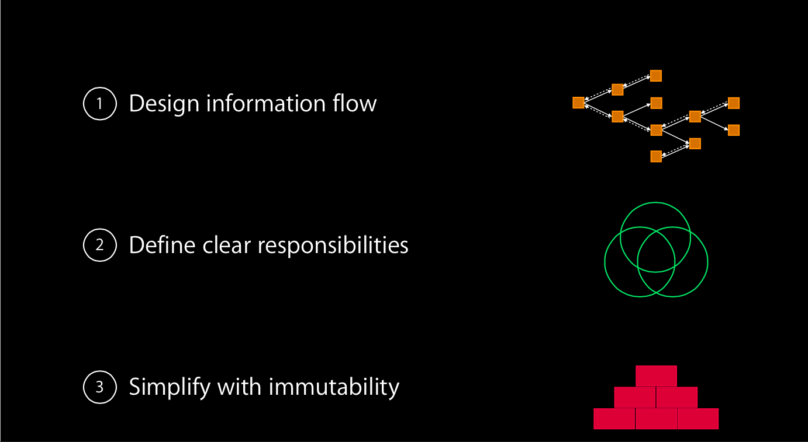
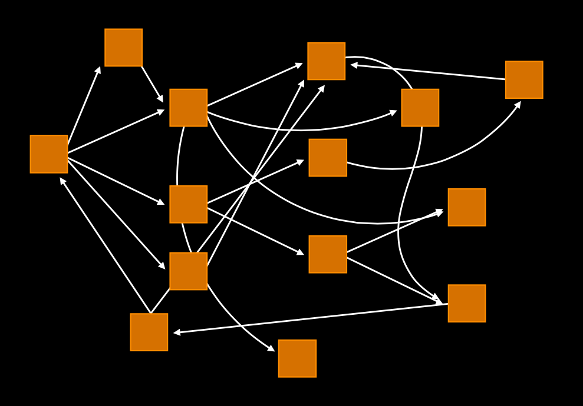
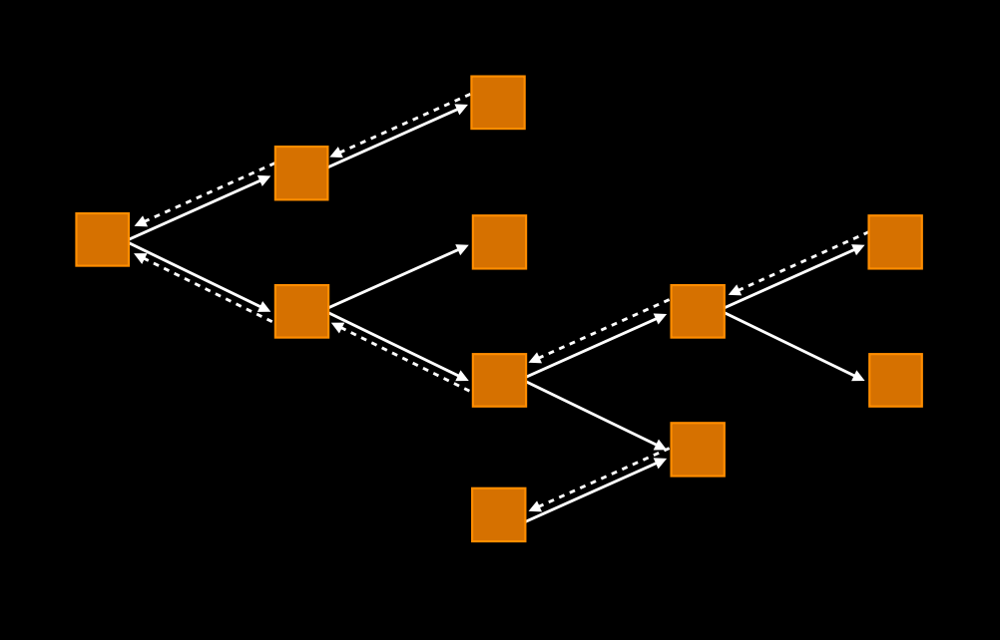

#WWDC 2014 
###Advanced iOS Application Architecture and Patterns （session 229）
--

这一个Session是对之前的Core iOS Application Architectural Patterns Session的延伸。

实际上内容是非常的不同的，前者的主要是对Cocoa框架里面涉及到的基本模式做一个总结，而后者更多是对整个软件架构的思索，主要设计数据流的设计,划分职责,多使用不变性。

这个Session部分内容对我来说是比较晦涩的。不过也让我学到新的概念与想法。多了组织的思路和方向。

1. design information flow  
   
   第一点是个人认为这个Session最有价值的地方。重点是理清楚什么是truth,什么是derived data。也就是什么是真正的原始数据，支撑数据。什么是延伸,拷贝出来的数据。
   
   弄清楚truth,还要设计information flow.一个良好的数据流不应该是这样的：
   
   
   
   而应该是这样的：
   
   
   
   说起来比较抽象，不过Session使用了几个例子来阐明。
   > 《Advanced iOS Application Architecture and Patterns》 中，把这个图叫做information flow。我们的直觉会告诉我们，这个信息的传递，应该是自上而下的树或是森林，而且最好是一个层次平衡结构，要清晰，每一个位置都有相对于的职责。那我们就需要制定一个规则。[^1]
   
   因此，在软件构建中，如何涉及复杂的信息传递，最好事先在纸上,脑海先设计一幅合理清晰的information flow.
  
2. define clear responsibilities
   
   这个是比较常见的清晰合理划分职责的问题。简单来说，比如一个View Controller中的网络请求部分,如果是其他ViewController也会用到的,我们一般是要把它抽离出来，单独处理。优化分类来达到解耦和复用的效果。
   
3. simplify with immutability

   利用不变性来简化程序。个人体会，举个最简单的例子，通常NSString的property attribute会设置为copy,这就是为了避免如果引用的是一个NSMutableString,防止NSMutableString被修改导致内容的修改。可能举得例子有点牵强。总而言之就是控制好数据的可变状态，争取更多使用不变性。

   
   
   
   [^1]: [iOS APP 架构漫谈](http://studentdeng.github.io/blog/2014/08/29/ios-architecture/) 