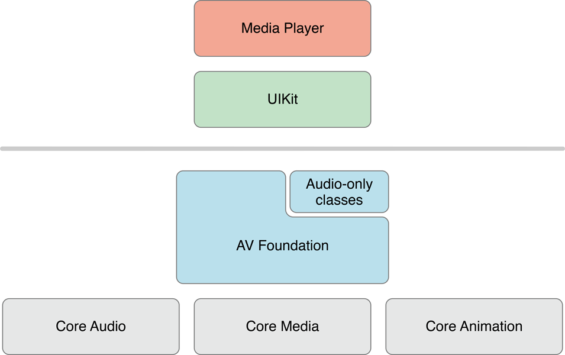
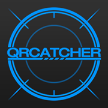
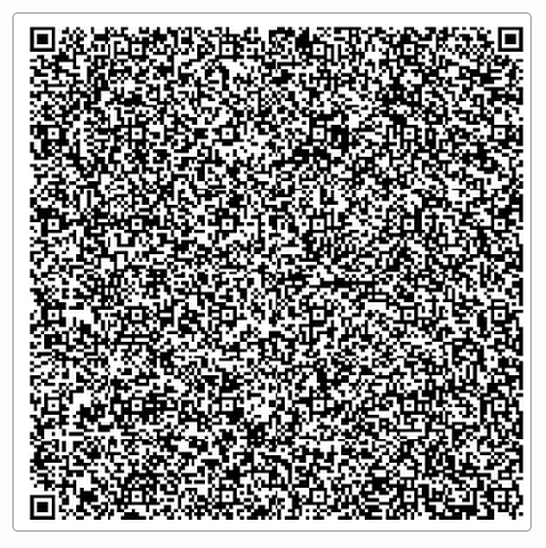

#iOS学习：AVFoundation 视频流处理

##框架

首先我们从整体对所需框架做个初步了解。

AVFoundation在相关框架栈中的的位置：

为了捕捉视频,我们需要这样几种类（与其它的子类）。

- AVCaptureDevice 代表了输入设备,例如摄像头与麦克风。
- AVCaptureInput 代表了输入数据源
- AVCaptureOutput 代表了输出数据源
- AVCaptureSession 用于协调输入与输出之间的数据流

并且还有AVCaptureVideoPreviewLayer提供摄像头的预览功能

可以用这样一幅图来概述：

##例子
实际应用AVFoundation来捕捉视频流并不复杂。

Talk is Cheap,Show me the Code.  
我们用代码简单地描述用AVFoundation捕捉视频的过程,其他捕捉音频,静态图像的过程也是大同小异的。

1. 创建AVCaputureSession。
	
	作为协调输入与输出的中心,我们第一步需要创建一个Session
	
	~~~objective-c
	AVCaptureSession *session = [[AVCaptureSession alloc] init];
	~~~
	
2. 创建AVCaptureDevice

	创建一个AVCaptureDevice代表代表输入设备。在这里我们制定设备用于摄像。
	
	~~~objective-c
	    AVCaptureDevice *device = [AVCaptureDevice defaultDeviceWithMediaType:AVMediaTypeVideo];
	~~~
	
3. 创建AVCaptureDeviceInput,并添加到Session中
	
	我们需要使用AVCaptureDeviceInput来让设备添加到session中, AVCaptureDeviceInput负责管理设备端口。我们可以理解它为设备的抽象。一个设备可能可以同时提供视频和音频的捕捉。我们可以分别用AVCaptureDeviceInput来代表视频输入和音频输入。
	
	~~~objective-c
	NSError *error;
AVCaptureDeviceInput *input = [AVCaptureDeviceInput deviceInputWithDevice:device error:&error];
[session addInput:input];
	~~~

4. 创建AVCaptureOutput

	为了从session中取得数据,我们需要创建一个AVCaptureOutput
	
	~~~objective-c
	    AVCaptureVideoDataOutput *output = [[AVCaptureVideoDataOutput alloc]init];
	~~~
	
5. 设置output delegate,将output添加至session,在代理方法中分析视频流

	为了分析视频流,我们需要为output设置delegate,并且指定delegate方法在哪个线程被调用。需要主要的是,线程必须是串行的,确保视频帧按序到达。
	
	~~~objective-c
	videoDataOutputQueue = dispatch_queue_create("VideoDataOutputQueue", DISPATCH_QUEUE_SERIAL);
	
	[videoDataOutput setSampleBufferDelegate:self queue:videoDataOutputQueue];
	
	[session addOutput:videoDataOutput];
	~~~
	
	我们可以在delegate方法中分析视频流。
	
	~~~objective-c
	captureOutput:didOutputSampleBuffer:fromConnection:,
	~~~

6. 开始捕捉

	~~~objective-c
	[session startRunning];
	~~~

通过上面的简单例子,我么可以看出使用AVFoundation来捕捉视频流并不是十分复杂。重点是使用的过程需要了解配置的细节,还有性能问题。

##实战

学习基础知识过后,让我们用个具体例子来进行阐明。

我们来做一个基于AVFoundation二维码识别应用：QRCatcher

应用已经上架[AppStore](https://itunes.apple.com/cn/app/qrcatcher/id993170818?mt=8) 并且完整[开源](https://github.com/100mango/QRCatcher)

	
项目架构：

~~~
|- Model
    |- URLEntity
|- View
    |- QRURLTableViewCell
    |- QRTabBar
|- Controller
    |- QRCatchViewController
    |- QRURLViewController
|- Tools
    |- NSString+Tools
    |- NSObject+Macro
~~~

项目并不复杂。典型的MVC架构.

- Model层只有一个URLEntity用于存储捕捉到的URL信息。
这次项目也顺便学习了一下CoreData。感觉良好,配合NSFetchedResultsController工作很幸福。

- View层则是一个TableViewCell和Tabbar,继承Tabbar主要用于改变tabbar高度。

- Controller层中QRCatchViewController负责捕捉与存储二维码信息, QRURLViewController负责展示与管理收集到的URL信息。

- Tools则是一些辅助方便开发的类。出自我自己平时使用收集编写维护的一个工具库 （[开源链接](https://github.com/100mango/MyTools_iOS)）在这个项目中主要用以检查URL是否合法,判断设备类型等。

介绍完基本的架构后,我们把精力放回AVFoundation模块上来。在这个项目中, AVFoundation主要负责二维码的扫描与解析。

我们直接来看QRCatchViewController中涉及的代码。

对于我们这个应用来说,只需两步核心步骤即可。

1. 设置AVFoundation

~~~objective-c
- (void)setupAVFoundation
{
    //session
    self.session = [[AVCaptureSession alloc] init];
    //device
    AVCaptureDevice *device = [AVCaptureDevice defaultDeviceWithMediaType:AVMediaTypeVideo];
    NSError *error = nil;
    //input
    AVCaptureDeviceInput *input = [AVCaptureDeviceInput deviceInputWithDevice:device error:&error];
    if(input) {
        [self.session addInput:input];
    } else {
        NSLog(@"%@", error);
        return;
    }
    //output
    AVCaptureMetadataOutput *output = [[AVCaptureMetadataOutput alloc] init];
    [self.session addOutput:output];
    [output setMetadataObjectTypes:@[AVMetadataObjectTypeQRCode]];
    [output setMetadataObjectsDelegate:self queue:dispatch_get_main_queue()];
    
    //add preview layer
    self.previewLayer = [AVCaptureVideoPreviewLayer layerWithSession:self.session];
    [self.preview.layer addSublayer:self.previewLayer];
    
    //start
    [self.session startRunning];
}
~~~

在这里我们可以看到和上面创建捕捉视频流的步骤基本是一致的。

也就是

1. 创建session
2. 创建device
3. 创建input
4. 创建output。

	这里是与捕捉视频流所不一致的地方。我们捕捉视频流需要的是AVCaptureVideoDataOutput,而在这里我们需要捕捉的是二维码信息。因此我们需要AVCaptureMetadataOutput。并且我们需要指定捕捉的metadataObject类型。在这里我们指定的是AVMetadataObjectTypeQRCode,我们还可以指定其他类型,例如PDF417条码类型。  
	完整的可指定列表可以在[这里](https://developer.apple.com/library/prerelease/ios/documentation/AVFoundation/Reference/AVMetadataMachineReadableCodeObject_Class/index.html#//apple_ref/doc/constant_group/Machine_Readable_Object_Types)找到。
	
	然后我们还要指定处理这些信息的delegate与队列。
	
5. 开始录制
	
	
2.实现代理方法：

~~~objective-c
- (void)captureOutput:(AVCaptureOutput *)captureOutput didOutputMetadataObjects:(NSArray *)metadataObjects fromConnection:(AVCaptureConnection *)connection
{
    for (AVMetadataMachineReadableCodeObject *metadata in metadataObjects) {
        if ([metadata.type isEqualToString:AVMetadataObjectTypeQRCode]) {
            
            self.borderView.hidden = NO;
            if ([metadata.stringValue isURL])
            {
                [[UIApplication sharedApplication] openURL:[NSString HTTPURLFromString:metadata.stringValue]];
                [self insertURLEntityWithURL:metadata.stringValue];
                self.stringLabel.text = metadata.stringValue;
            }
            else
            {
                self.stringLabel.text = metadata.stringValue;
            }
        }
    }
}
~~~

我们需要在代理方法里面接收数据,并根据自己的需求进行处理。在这里我简单地进行了URL的测试,如果是的话则打开safari进行浏览。

##总结

在这里仅仅是通过一个二维码的应用来展示AVFoundation处理视频流能力。事实上，AVFoundation能够做得更多。能够进行剪辑,处理音轨等功能。如果我们需要对视频与音频相关的事务进行处理,不妨在着手处理,寻找第三方解决方案前,看看这个苹果公司为我们带来的强大模块。

PS:最后来点好玩的东西：

大家可以用手机上的微信扫一扫这张二维码（莫慌,虽然稍微有点密集）：

自己用iOS上微信的最新版本进行扫描(版本6.3 完成这篇文章的时间是2015.5.27)

是无法完成扫描解析的,而用QRCatcher是可以准确扫描成功的 :）。欢迎下载试用。

	
