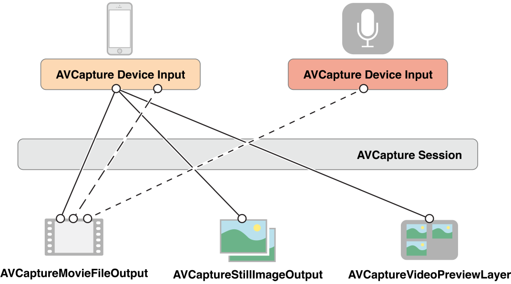

#iOS学习：AVFoundation 视频流处理

##框架

首先我们从整体对所需框架做个了解。

为了捕捉视频,我们需要这样几种类（与其它的子类）。

- AVCaptureDevice 代表了输入设备,例如摄像头与麦克风。
- AVCaptureInput 代表了输入数据源
- AVCaptureOutput 代表了输出数据源
- AVCaptureSession 用于协调输入与输出之间的数据流

并且还有AVCaptureVideoPreviewLayer提供摄像头的预览功能

可以用这样一幅图来概述：

##例子
实际应用AVFoundation来捕捉视频流并不复杂。

Talk is Cheap,Show me the Code.  
我们用代码简单地描述用AVFoundation捕捉视频的过程,其他捕捉音频,静态图像的过程也是大同小异的。

1. 创建AVCaputureSession。
	
	作为协调输入与输出的中心,我们第一步需要创建一个Session
	
	~~~objective-c
	AVCaptureSession *session = [[AVCaptureSession alloc] init];
	~~~
	
2. 创建AVCaptureDevice

	创建一个AVCaptureDevice代表代表输入设备。在这里我们制定设备用于摄像。
	
	~~~objective-c
	    AVCaptureDevice *device = [AVCaptureDevice defaultDeviceWithMediaType:AVMediaTypeVideo];
	~~~
	
3. 创建AVCaptureDeviceInput,并添加到Session中
	
	我们需要使用AVCaptureDeviceInput来让设备添加到session中, AVCaptureDeviceInput负责管理设备端口。我们可以理解它为设备的抽象。一个设备可能可以同时提供视频和音频的捕捉。我们可以分别用AVCaptureDeviceInput来代表视频输入和音频输入。
	
	~~~objective-c
	NSError *error;
AVCaptureDeviceInput *input = [AVCaptureDeviceInput deviceInputWithDevice:device error:&error];
[session addInput:input];
	~~~

4. 创建AVCaptureOutput

	为了从session中取得数据,我们需要创建一个AVCaptureOutput
	
	~~~objective-c
	    AVCaptureVideoDataOutput *output = [[AVCaptureVideoDataOutput alloc]init];
	~~~
	
5. 设置output delegate,将output添加至session,在代理方法中分析视频流

	为了分析视频流,我们需要为output设置delegate,并且指定delegate方法在哪个线程被调用。需要主要的是,线程必须是串行的,确保视频帧按序到达。
	
	~~~objective-c
	videoDataOutputQueue = dispatch_queue_create("VideoDataOutputQueue", DISPATCH_QUEUE_SERIAL);
	
	[videoDataOutput setSampleBufferDelegate:self queue:videoDataOutputQueue];
	
	[session addOutput:videoDataOutput];
	~~~
	
	我们可以在delegate方法中分析视频流。
	
	~~~objective-c
	captureOutput:didOutputSampleBuffer:fromConnection:,
	~~~

6. 开始捕捉

	~~~objective-c
	[session startRunning];
	~~~

通过上面的简单例子,我么可以看出使用AVFoundation来捕捉视频流并不是十分复杂。重点是使用的过程需要了解配置的细节,还有性能问题。

##实践

	

	
