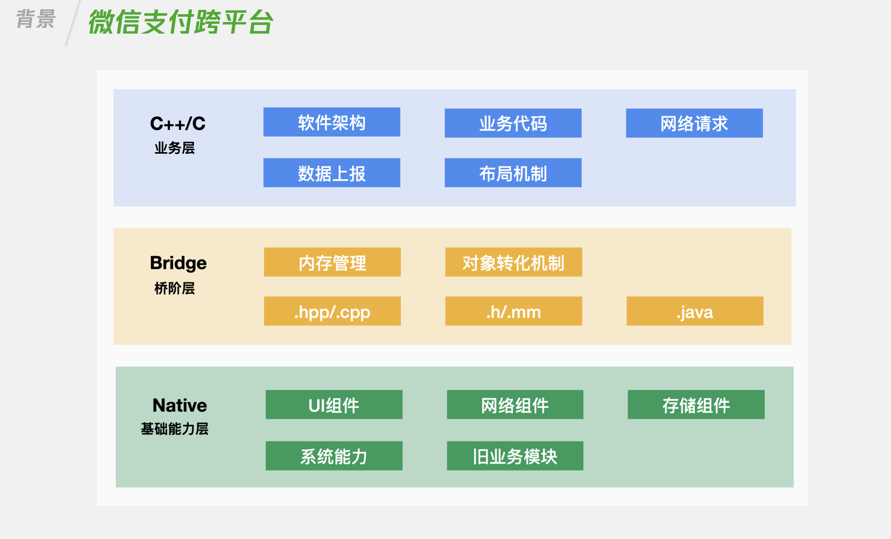
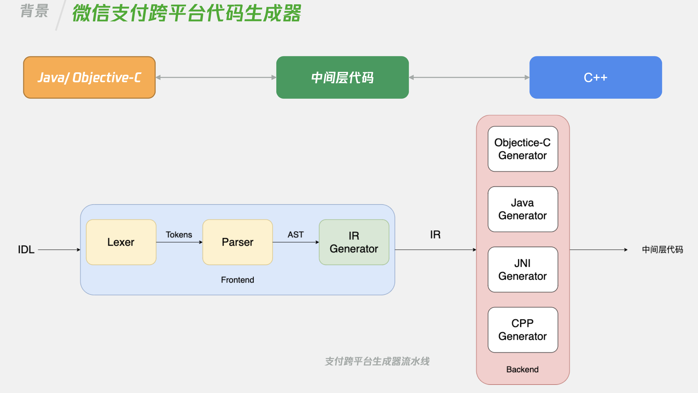

# 基于 Swift 编写严肃脚本工具

## 背景

WWDC 2021 刚举办完毕， 可以看到 Swift 已经成为苹果平台事实上最重要的编程语言。

不过拉回到大家使用最频繁的应用， 我们通过分析国外免费榜，和国内免费榜前一百名应用的 Swift 混编占比。

会发现国外的占比达到了 91%， 国内的只有 59%。  并且国内的 59% 的 Swift 混编， 可能只是简单引入了 Swift 做了一些最简单的桌面小部件 , 应用场景非常有限。

### Swift in WeChat

以 微信为例， Swift 在微信目前的应用场景是四个。

1.  微信 Apple watch 端

2.  订阅号助手 ，这是个独立应用，提供给公众号运营者使用的。

3.  部分机器学习逻辑。

4.  脚本工具

其中前三项其实都是和业务有关， 不同公司的业务技术选型有自己的思考， 我们比较难在短时间内就能推动业务向 Swift 迁移。    但是作为有品味的开发者， 我们还是希望能在日常生活中，更多地使用 Swift， 通过 Swift 强大的类型系统， 安全性，表达性写出更优质的代码。

那么我们就有一个选择， 就是通过 Swift 来编写脚本工具，自动化工具。

### 支付跨平台生成器

微信支付跨平台代码生成器就是通过 Swift 编写的。 首先简单介绍一下微信支付跨平台的框架。

首先我们来看一下微信支付跨平台的整体框架图。

可以看到支付跨平台整体框架的分层是这样的：

- 最下层是 Native 层，我们日常开发，往往都是用 C++提供能力给 Native 层。 但是在基于 C++ 跨平台框架中，是原生提供能力给 C++ 层。

- 中间则是桥阶层，这里包括了 C++ 和 Java, OC 桥接相关的机制。

- 最上层则是我们的 C++ 层。软件架构，业务代码会在这一层。

可以看到微信支付的跨平台框架算是业界非常特殊的一个跨平台框架。核心是基于 C++ 来编写跨平台业务代码，是微信自研的跨平台框架。

支付跨平台重度依赖 C++ 与 Java,OC 的交互。 而交互所用到的中间层，胶水层如果靠人工编写和维护，是非常易错与耗时的。因此需要我们设计一个代码生成器来完成。

它的流水线是这样的， 接口定义文件，经过 Lexer, Parser 后会以 AST 表示，代码生成器会进一步将 AST 转换为更清晰，可复用的 IR 。最终由各个语言的生成器，负责生成最后的中间层代码。

上面这整套流水线都是基于 Swift 搭建的。

大家现在可能还是对这个代码生成器一头雾水，不过可以隐约感觉到，这个代码生成器是比较严肃的，需要投入的时间和精力也比较大。这里主要作为一个例子，让大家感知到 Swift 是能支撑和编写这种严肃脚本工具的。

那么我们平时写一些简单的代码生成器，脚本工具，一般追求简单方便，会去使用像 Python 这样的语言. 但是从可维护性，健壮性来说， 使用 Swift 编写会是更好的一个选择。

大家可能会觉得 Swift 拿来编写命令行工具会很麻烦， 很繁琐，没有像 Python 那么方便。

实际上，用 Swift 编写脚本代码是一种愉快享受的体验。 今天就和大家分享一下， 怎么使用 Swift 编写脚本工具。

## 大纲

1.  创建工程
2.  编写代码
3.  测试
4.  发布
5.  进阶操作

### 1. 创建工程

我们通过 Swift Package Manager 来直接建立工程。 Swift Package Mangaer 除了是一个包管理系统，也能帮助我们很好地创建命令行工具。

~~~shell
$ mkdir script
$ cd script
$ swift package init --type executable
~~~

我们来看一下创建后的文件结构：

~~~
├── Package.swift
├── README.md
├── Sources
│   └── script
│       └── main.swift
└── Tests
    └── scriptTests
          └── scriptTests.swift

~~~

可以看到 Swift Package Manager 为我们创建了三个组成部分。

- package.swift 文件负责定义我们这个脚本工程的架构和依赖管理。

- main.swift 文件则是我们编写脚本代码的地方。

- scriptTests.swift 文件则是我们编写单元测试的地方。

那么我们直接打开 package.swift 文件， Swift Package Manager 会自动化帮我们创建 Xcode 工程。

我们直接点击运行工程，我们就可以看到终端输出了信息。

到了这一步，我们其实就已经可以愉快地使用 Swift 编写我们的脚本代码了。

#### 工程结构与依赖管理

不过为了更方便地进行职责分离，还有更好地做后续的代码复用。 我们来对工程架构和依赖管理做一个调整。

首先我们来看一下 package.swift 的内容。

~~~swift
let package = Package(
    name: "script",
    dependencies: [
    ],
    targets: [
        .target(
            name: "script",
            dependencies: []),
        .testTarget(
            name: "scriptTests",
            dependencies: ["script"]),
    ]
)
~~~

通过 Swift Package Manager 来管理工程结构有个优势就是它的工程结构是和文件夹结构相呼应的。

我们看到 package.swift  里面实际上就是创建了一个 Package 对象。
这里我们声明了两个 target, 一个的名字是 script. 我们可以看到 Sources 文件夹 下面也有一个同名文件夹 script.  Swift Package Manager 知道这个和 target 同名的文件夹下面存放的是 target 的源代码。

当然我们也可以显式声明 target 源代码的位置。

~~~swift
let package = Package(
    name: "script",
    dependencies: [
    ],
    targets: [
        .target(
            name: "script",
            dependencies: [],
            path:"./Sources/script"),
        .testTarget(
            name: "scriptTests",
            dependencies: ["script"]),
    ]
)
~~~

另外大家可能有疑问，这个 target 只是写了一个名字， Swift Package Manger 怎么知道我是要去创建一个可执行的脚本工具呢？

答案就是因为我们 script 文件夹里面有个 main.swift 文件。 不过我觉得我们应该尽量减少这种隐式的定义，因此我们进一步显式声明这个 target 为 可执行 target。 这样后续的维护者就会更清晰我们的工程架构。

~~~swift
let package = Package(
    name: "script",
    dependencies: [
    ],
    targets: [
        .executableTarget(
            name: "script",
            dependencies: []),
        .testTarget(
            name: "scriptTests",
            dependencies: ["script"]),
    ]
)
~~~

好了，目前我们的工程结构已经比较清晰了。 但是我们追求的是写更严谨，可复用的代码。 因此我们还要进一步把核心的逻辑代码和命令行工具代码分离开来。

这样后续我们其他模块也可以复用核心逻辑。 同时命令行工具只需要专心于命令行相关的代码处理即可。 也即进行模块分离。 将我们的代码 分为命令行模块 还有 核心逻辑库 模块。

操作非常简单，我们只需要在 Sources 文件夹下面创建一个文件夹，这里我们把我们的核心逻辑代码库叫做 core.

然后我们在 package.swift 文件里面声明多一个 target，同时让我们的可执行 target 依赖于我们的核心逻辑库 target.

~~~swift
let package = Package(
    name: "script",
    dependencies: [
    ],
    targets: [
        .executableTarget(
            name: "script",
            dependencies: ["core"]),
        .target(
            name: "core",
            dependencies: []),
        .testTarget(
            name: "scriptTests",
            dependencies: ["script"]),
    ]
)
~~~

#### 小结

目前为止，我们了解通过 Swift 编写命令行工具的设置很简单， 只需要简单一行命令， Swift Package manger 就帮我们搭建好了基础框架。

同时我们也进一步了解了  package.swift  是怎么定义工程结构的， 我们进一步将我们的命令行工具划分为命令行模块和核心逻辑库模块， 为编写严谨，可复用的代码打下了基础。

### 2. 编写代码

到目前为止，我们的工程结构已经很清晰了，我们可以继续编写我们的代码了。

那么假设说我们需要写一个生成随机数的命令行工具， 我们大概需要写出这样的代码：

~~~swift
import Darwin

let arguments: [String] = Array(CommandLine.arguments.dropFirst())

guard let numberString = arguments.first else {
    print("no argument")
    exit(1)
}

guard let number = Int(numberString) else {
    print("not number")
    exit(1)
}

print(Int.random(in: Int.min...number))
exit(0)
~~~

首先，我们要获取命令行参数数组， 然后解析数组里面的内容， 如果发现参数不符合，则报错。 最后生成并打印随机数。

看起来代码还是很简单的。 不过注意，这里我们的命令行工具也没有 help 方法供使用者知道如何使用。  并且这里仅仅只是一个参数而已， 一个复杂的命令行的参数会有很多个，还要有可选参数，标签这些形式的参数 。

实际上，我们如果要手动编写一个健壮健全的命令行工具，可能花费在这些繁琐的解析参数，参数校验，提供帮助文档上面的时间， 比写实际核心逻辑的时间还要长。

为此，我们可以引入苹果官方提供的  Argument Parser 库来简化编写命令行工具都要用到的重复工作。

我们还是打开 package.swift 文件， 给 dependencies 加上仓库的声明，然后在我们的 脚本 target 里面声明好依赖。

~~~swift
let package = Package(
    name: "script",
    dependencies: [
        .package(url: "https://github.com/apple/swift-argument-parser", from: "0.4.0")
    ],
    targets: [
        .executableTarget(
            name: "script",
            dependencies: ["core",
                           .product(name: "ArgumentParser", package: "swift-argument-parser")]),
        .target(
            name: "core",
            dependencies: []),
        .testTarget(
            name: "scriptTests",
            dependencies: ["script"]),
    ]
)
~~~

那么刚才的代码就可以简化为这样：

~~~swift
import ArgumentParser

struct Random: ParsableCommand {
    @Argument(help: "unsigned number")
    var highValue: UInt
    
    func run() {
        print(UInt.random(in: 0...highValue))
    }
}

Random.main()
~~~

可以看到，我们只需要声明一个遵循 ParsableCommand 协议的结构体， 然后声明好参数，接下来在 run 方法里面处理逻辑即可。 Argument Parser 会帮我们处理好参数解析。

假如用户不提供参数，直接调用，我们可以看到清晰的报错信息。

~~~
Error: Missing expected argument '<high-value>'
Usage: random <high-value>
  See 'random --help' for more information.
~~~

用户输入 --help 后， 也可以看到清晰的用法。

~~~
USAGE: random <high-value>

ARGUMENTS:
  <high-value>            unsigned number

OPTIONS:
  -h, --help              Show help information
~~~

由于时间关系，这里只用一个简单的小 demo 说明 Argument Parser 能简化我们用 Swift 编写脚本工具的很多工作，也使得我们的脚本工具更加健壮和完善, Argument Parser 库还有很多功能能够增强我们脚本的可读性，减少我们的重复工作。

#### 小结

这一步我们通过编写一个简单的生成随机数小工具来感受 Swift 编写脚本工具， 同时为了简化命令行参数的处理，提供用户操作指引， 我们引入了苹果官方提供的 Argument Parser 库， 大大地减少了繁琐的命令行参数解析，同时还完善了命令行工具的操作指引。

### 3. 测试

当我们编写好逻辑代码后， 就可以进入测试环节了。

这个时候，我们前面把我们命令行工具划分为  命令行模块和核心逻辑模块 的好处就可以凸显出来的。

以微信支付跨平台代码生成器为例：

我们对核心代码生成器逻辑进行单元测试， 这一部分完全不需要涉及命令行相关的测试。

在完成核心逻辑测试后， 我们可以编写模拟用户直接使用命令行工具的测试。

~~~swift
func testRosseta() throws {
//1. 创建进程
let process = Process()
//2. 设置可执行文件位置，这里我们设置的是 Xcode 编出来的可执行文件路径
process.executableURL = Bundle.allBundles.first { $0.bundlePath.hasSuffix(".xctest") }! .bundleURL.deletingLastPathComponent().appendingPathComponent("Rosseta")
//3. 设置参数
process.arguments = [ "--objc-path","~/Desktop/RossetaGenerated", "--cpp-path","~/Desktop/RossetaGenerated", ]
//4. 设置Pipe, 用于获取打印内容
let pipe = Pipe()
process.standardOutput = pipe
//5. 启动进程
try process.run()
process.waitUntilExit()
//6. 读取命令行工具输出内容，判断是否符合预期
let data = pipe.fileHandleForReading.readDataToEndOfFile() let output = String(data: data, encoding: .utf8) XCTAssertEqual(output, "success")
}
~~~

我们可以通过创建一个进程， 然后指定我们可执行文件的位置。 然后设置好参数。 启动线程即可。

那么如何检查结果呢？ 我们可以通过创建一个管道， 将其设置为线程的标准输出。

等我们的命令行执行结束后， 我们可以读取命令行输出的内容， 判断命令行是不是已经执行成功。

#### 小结

那么前面我们已经完成创建工程， 编写代码， 还有测试。 剩下的就是发布我们的命令行工具了。

### 4. 发布

非常简单， 我们只需要执行一行代码来生成可分发的可执行文件

~~~
swift build --configuration release
~~~

文件的位置位于 .build/release/ 目录。 我们就可以将它进行分发拉。

### 5. 进阶操作：

接下来介绍一些进阶操作

1.  异步操作

    ~~~swift

    URLSession.shared.dataTask ( with: url, completionHandler: { _, response, _ in
        print ( response )
        //退出
        exit ( EXIT_SUCCESS )
	 }) .resume ( )

    //启动 RunLoop
    RunLoop.main.run ( )
    ~~~

    有的时候，如果我们的命令行逻辑需要执行像网络请求， 如果直接跑的话，我们的命令行执行完毕，网络数据还没回来。

    这个时候，我们只需要启动 Runloop 即可。 当执行完毕后，调用 Exit 即可退出。

2.  Appkit in 命令行

	基于 Swift 编写脚本工具，我们除了能够处理逻辑代码，还能够直接和 GUI 框架进行交互。
	比如说，我们在代码里面经常需要用户指定文件路径， 那么我们基于 Swift 能够直接调用 Appkit, 弹起 Mac 系统选择文件的控件。
	
	~~~swift
	import AppKit
	
	NSApplication.shared.setActivationPolicy(.accessory)
	
	func selectFile() -> URL? {
	    let dialog = NSOpenPanel()
	    dialog.allowedFileTypes = ["jpg", "png"]
	    guard dialog.runModal() == .OK else { return nil }
	    return dialog.url
	}
	
	print (selectFile()?.absoluteString ?? "")
	~~~

3.  SwiftUI in 命令行

	不仅如此，有了 SwiftUI 之后，我们还能够直接在脚本工具里面写  Mac 应用， 这个的可玩性很高，直接绕过了 AppStroe 的鉴权机制，应该是目前最方便能直接在 Mac 系统分发应用的途径了。 我们编好可执行文件之后，就能分享给其他用户，无需签名鉴权等机制。
	
	~~~swift
	struct App: SwiftUI.App {
	    @State var filename = "Filename"
	    @State var showFileChooser = false
	
	  var body: some Scene {
	    WindowGroup {
	        HStack {
	              Text(filename)
	              Button ("select File")
	              {
	                let panel = NSOpenPanel()
	                panel.allowsMultipleSelection = false
	                panel.canChooseDirectories = false
	                if panel.runModal() == .OK {
	                    self.filename = panel.url?.lastPathComponent ?? "<none>"
	                }
	              }
	            }
	        .frame(maxWidth: .infinity, maxHeight: .infinity)
	    }
	    .windowStyle(HiddenTitleBarWindowStyle())
	  }
	}
	App.main()
	~~~
	

## 总结

最后我们来回顾一下文章的内容。

1. 我们通过 Swift Package Manger 创建了工程， 并调整了工程结构，依赖管理。

2. 我们通过一个简单生成随机数的工具感受了 Swift 编写脚本工具， 并给我们的工程引入了苹果开源的 Argument Parser 库。用于简化命令行参数解析，优化工具说明。
3.  我们分别对逻辑代码和命令行 API 进行了测试。
4. 我们通过一行简单的代码，就能生成可执行文件进行分发。
5. 最后我们发现通过Swift 编写脚本工具，还能直接和 AppKit, SwiftUI 进行交互，非常的具备扩展性。

这篇文章并没有展示特别复杂的逻辑代码， 但是上面展示的步骤，原则，就能支撑像微信支付跨平台代码生成器这样的命令行工具。   

Swift 是一门优雅的编程语言，下次无论遇到一些小工具，还是大型严肃工具需要编写， 大家都可以尝试用 Swift 愉快地编写了。

文章中呈现的代码 ，可以在这里下载 demo 把玩：[链接](https://github.com/100mango/zen/tree/master/%E5%9F%BA%E4%BA%8E%20Swift%20%E7%BC%96%E5%86%99%E4%B8%A5%E8%82%83%E8%84%9A%E6%9C%AC%E5%B7%A5%E5%85%B7/script)

### 参考链接：

 [官方教程](https://developer.apple.com/documentation/xcode/creating_a_standalone_swift_package_with_xcode)

 [社区教程集合](https://github.com/artemnovichkov/Swift-For-Scripting)
