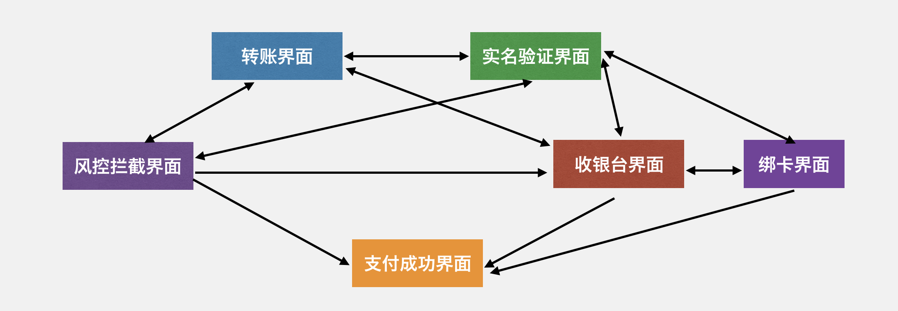
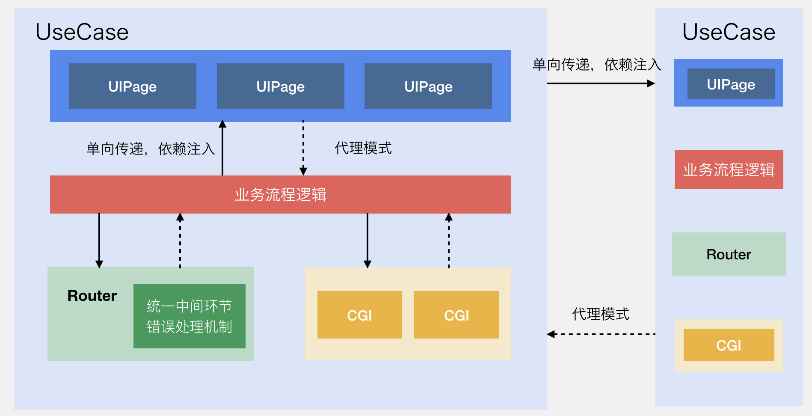

# 微信支付跨平台软件架构

### 大纲

- 背景
- 线上效果指标
- 什么是软件架构
- 为什么需要软件架构
- 从零到一构建支付跨平台软件架构
	
	1.抽象业务流程
	
	2.加入路由机制
	
	3.管理网络请求
	
	4.规范数据传递
- 总结

## 背景

作为一个重要业务，微信支付在客户端上面临着各种问题。其中最核心问题就是分平台实现导致的问题：

1. iOS 和安卓实现不一致
	- 容易出 Bug
	- 通过沟通保证不了质量
2. 扩展性差，无法快速响应业务需求
	- 需求变更迭代周期长
	- 数据上报不全面
3. 质量保障体系不完善
	- 缺少业务及设计知识沉淀
	- 协议管理松散
	- 缺少统一的自动化测试
4. 用户体验不一致

	比如下图就是之前安卓和 iOS 没有统一前的收银台。

	

为了解决分平台实现这个核心问题，并解决以往的技术债务。我们建立起了一整套基于 `C++` 的跨平台框架，并对核心支付流程进行了重构。

微信支付跨平台从 iOS 7.0.4 版本起， 安卓从 7.0.7 版本起全面覆盖。

## 线上效果指标

以 iOS 上线情况为例:

1. Crash 率

	上线前后 Crash 率保持平稳，没有影响微信稳定性，跨平台支付无必现 Crash，做到了用户无感知切换。
	
	举个例子，大家可以用微信发一笔红包，拉起的收银台和支付流程就是由基于C++编写的跨平台代码所驱动的。

2. 效能提升

	

	以核心支付流程代码为例，跨平台需要 3512 行，iOS 原生需要 6328 行。 减少了近 45% 的代码。

	以新需求开发为例：

	7.0.4 版本需求一：收银台改版

	- 跨平台实现： iOS + 安卓共计 5 人日，在封板时间前完成
	- 原生实现：  iOS， 安卓封板时间后一周才基本完成

	7.0.4 版本需求二：简化版本收银台

	-  跨平台实现： iOS + 安卓 共计 3 人日，在封板时间前完成
	- 原生实现：iOS， 安卓封板时间后一周才基本完成

那么支付跨平台软件架构怎么样有效进行质量保障，并且提升生产力呢？这是这篇文章的主要内容。

> 对基于 C++ 如何从零到一构建跨平台框架感兴趣的同学，可以在 https://github.com/100mango/zen/blob/master/Qcon2019/%E5%9F%BA%E4%BA%8E%20C%2B%2B%20%E6%9E%84%E5%BB%BA%E5%BE%AE%E4%BF%A1%E5%AE%A2%E6%88%B7%E7%AB%AF%E8%B7%A8%E5%B9%B3%E5%8F%B0%E5%BC%80%E5%8F%91%E6%A1%86%E6%9E%B6.key 下载我在 2019 QCon 广州站的演讲 《基于 C++ 构建微信客户端跨平台开发框架》的 Keynote. 

## 什么是软件架构

什么是软件架构？ 正如 Ivar Jacobson （UML 之父）说过的一样，找五个人来回答这个问题，五个人可能都有各自不同的答案。

架构定义可以有很多种说法，从代码规范到发布流程都可以是架构的一部分。

针对微信支付的业务特点，这里对架构的定义是：架构是系统的组成部件及其之间的相互关系（通讯方式）。 这更符合我们程序员日常编写业务代码时对架构的理解。也就是通俗意义上讲的 `MVC`，`MVVM` 等。

## 为什么需要软件架构

早在 1986 年的时候，人月神话的作者在讨论软件的复杂性时，谈到：软件的本质复杂性存在于复杂的业务需求中。

而管理复杂性，最根本的手段就是职责分离。为了实现职责分离，代码重用，架构慢慢地复现出来。架构的本质是管理复杂性。

没有架构，我们所有的代码都耦合在一起，人类的心智模型不擅长处理这种复杂性，架构的设立，和图书馆的图书分类，公司的组织划分等，本质都是一样的。是为了管理复杂性，以取得更高的生产力。

## 从零到一构建支付跨平台软件架构

在移动客户端领域，业界基于 `C++` 来编写业务代码，并没有成熟的架构。即使使用 C++ 编写业务逻辑，但都不涉及 UI，不涉及界面的跳转流程。

既然业界没有一个成熟的架构可借鉴，那么是不是直接把业界通用的架构简单套用一下就好？

### 1. 抽象业务流程

现在业界通用的有 MVC , MVP, MVVM 。 这些大家都熟悉的软件架构。但是这些软件架构都存在一个问题：  那就是没有处理好业务流程， 界面转场。

微信支付的流程多。而流程就是由一个个的界面（ViewController，Activity）和相关的业务逻辑组合而成。

上面的 MV(X) 模式忽略了一个非常重要的一点，那就是业务流程，界面的转场究竟由谁负责。 也即 ViewController 与 ViewController 之间的关系由谁维护，业务流程的逻辑写在哪里。 如果还按照传统的 MVC 模式，那么 ViewController 自己负责和不同的 ViewController 通讯。 那么 ViewController 得不到复用，更致命的是业务流程的代码非常不清晰，业务流程的代码都被分散到各个 Controller 中， 而一个 Controller 又可能耦合了多个业务的代码。

举个例子： 一个普通的转账流程，可能会涉及风控拦截，实名验证， 收银台， 绑卡，支付成功页等等。如果是基于 `MVC` 这种架构的话，很快代码会变得难以维护。

因此，为了适应微信支付流程多，界面跳转复杂的特点。架构抽象的第一步就是将业务流程抽象为一个独立的角色 `UseCase`。同时, 把界面抽象为 `UIPage`。  一个大的业务流程可以分解为一个个小的业务流程。

和刚才基于 MVC 混乱的架构相比：

1. 业务流程的代码能够聚合到 UseCase 中，而不是分散到原来 iOS, 安卓的各个 ViewController，Activity 中。

2. 业务流程和界面得到了复用。

3. 契合微信支付多流程，界面跳转复杂的业务特点。

### 2. 加入路由机制

既然流程得到了抽象，这个时候需要针对业务流程做更深的思考。 在开发支付业务流程时，开发者不可绕过的问题有：

1. 流程之间，页面之间的流传。

	

	比如我们要给一个朋友转账，输入金额，确认支付,触发 Cgi 后。 下一个流程是多变的。有可能用户需要去实名，有可能用户要进入一个安全拦截的 WebView，或者是正常拉起收银台。
	
	> 本文中的名词 `CGI` 可以理解为一个网络请求，类似HTTP请求。 

	那么以往在 iOS, 安卓分开实现时，都没有一个统一的处理机制。要么就是通过网络回包的某个字段来判断，要么就是本地维护一些状态来决定下一步走什么流程等等。非常繁琐，易错。

2. 特殊流程的处理

	

	支付业务流程还有个特殊的地方，那就是在正常流程的中间，往往很多时候要需要插入一些特殊流程。 比如有些地方要跳转 Webview, 有些地方要跳转小程序，有些地方要弹窗告知用户风险，或者终止当前流程，等等。我们经常需要在业务代码里面不断重复增加这样的处理。

这些问题，引导我想到，微信支付需要一个路由机制。

首先了解一下路由机制。

路由机制的核心思想，就是通过向路由传递数据，然后路由解析数据，并响应。

结合微信支付和网络密切相关的特点。创新地将支付领域模型作为传递的数据。

那么怎么建立这个支付领域模型的呢？

建模，就是建立映射。 领域知识 + 建模方法 = 领域建模。那么这里的领域知识，就是对支付业务流程的理解。建模方法，我采用了 UML 建模。最终会落地为 Proto 协议供客户端和后台一起使用。

首先，微信支付业务特点就是和网络密切相关，流程和页面往往是由 Cgi 串联起来。因此建立模型时，最外层便是网络回包。对于路由机制，这里我们只关心路由数据模型。

路由数据模型由 路由类型，还有各个路由类型所需要的信息组合成。

路由类型清晰的定义了要触发的行为。 究竟是要开启一个 UseCase，还是要打开一个界面，或者 网页，小程序，弹窗等等。

然后就是这些行为所需要的数据。比如打开小程序所需要的参数，弹窗所需要的参数等。

建立支付领域模型后，我们路由的解析就变得非常清晰了。路由解析之后，会根据路由类型，触发不同的动作。

比如流程，界面流转，会交给 UseCase 处理。

而特殊流程，比如打开小程序，打开 webview, 弹窗这些行为会统一进行处理。

我们在第一步把业务流程抽象为 UseCase。第二步则加入了路由机制。

加入路由机制后，支付跨平台的软件架构演进为这个样子。

加入路由机制后，对比 iOS，安卓原来的旧架构:

1. 统一了流程，页面的流转。清晰，易维护。
2. 统一了特殊流程的处理，减少重复工作。
3. 在加入路由机制的时候，结合微信支付和网络密切相关的特点进行了支付领域建模。支付后台协议重构 2.0 的核心思想也是围绕着这个路由机制展开。

再来看一下，加入路由机制后，对生产力的提升。以支付流程打开 WebView, 小程序为例，减少将近 83% 的代码。 更重要的是，这里的特殊流程，是在路由机制里面统一处理的，没有耦合到业务代码中，并且是可复用的。

### 3. 管理网络请求

首先看看原来 iOS 处理支付网络请求的缺陷：

原来支付的请求，都是通过一个单例网络中心去发起请求，然后收到回包后，通过抛通知，或者调用闭包的方式回调给业务侧。

会存在这样的问题：

1. CGI 一对多通讯问题。

	举个之前遇到的问题。

	
	
	
	
	1. 进入钱包页面后，发起了一个 Cgi
	2. 然后进入收付款页面也发起同一个 Cgi.
	3. 如果收付款发起的回包先到
	4. 然后钱包首页的回包再到。
	
	那么钱包发起的 Cgi 的回包就会覆盖收付款页面的数据。 之前在 iOS 只能通过修修补补，增加场景值，增加些标记位来解决。可能某一天就会又出现新的坑。

2. CGI 生命周期问题。

	

	不时会有用户反馈一下，怎么没有做什么操作，突然就会弹出网络报错。

	原因就是 Cgi 的生命周期有问题，在业务结束后，Cgi 的回包仍然得到了处理。

解决方案：

1. 将 Cgi 抽象为独立对象

	在架构设计上来说，旧架构是通过单例模式实现的集约型 API，而我们新的架构则是通过命令模式实现的离散型 API。

	也就是将 Cgi 封装为独立对象。我们把 Cgi 相关属性和能力内聚起来。 开发业务时，只需简单继承 BaseCgi，设置一下参数即可。

	

2. 划分职责，明确生命周期

   关于 Cgi 由谁发起，之前安卓和 iOS 都没有一个统一的做法。有些人会放到 Activity，ViewController，和 UI 代码耦合起来。

   因此，在跨平台软件架构中，我们统一由业务流程 UseCase 进行发起。 并且生命周期是一对一的，一个 Cgi 只会有一个 UseCase 处理， UseCase 销毁后，Cgi 也随之销毁。

对比旧架构：

1. 杜绝了一对多通信造成的 Bug
2. 生命周期和业务逻辑绑定，不会出现业务结束，Cgi 回来后再触发动作。
3. 高内聚，低耦合。将 Cgi 相关的数据，能力集中处理，业务侧无需感知。
4. 提供统一的缓存，加密能力。

第一步和第二步，我们抽象了业务流程，加入了路由机制。

在第三步管理网络请求后。我们的软件架构演进为这样子。

### 4. 规范数据传递

iOS 和安卓的旧架构都存在信息传递不当和数据污染问题。这个问题最严重。iOS 和 安卓都出过不少 bug。

首先我们来看看最近现网出现过的问题：

之前 iOS 出现，不少内部同事，外部的用户都在反馈：进行零钱页后，会无故弹空白框。 而支付又和金钱有关，引起用户的恐慌。

https://user-images.githubusercontent.com/5073511/132854034-e94a5642-7f39-4350-a91e-4831b5857ce2.mp4

具体原因就是:

1. 进入支付首页时，后台返回了数据，然后被写入到一个公共的 Model.
2. 然后进入钱包页，再进入零钱页。这个公共 model 一路被传递过去。
3. 然后零钱页读取了公共 Model 的数据，但是代码无法处理，导致出现了这个让用户恐慌的问题。

除此之外，之前还有有很多发生在安卓，iOS ，像钱包页零钱展示错误。 付款的时候。银行卡失效等等问题。

这些问题五花八门，看起来发生的地方，场景都不一样。每次遇到这类问题的时候，就只能去修修补补。

但是深究下去，会发现真正的原因，是软件架构上存在的问题：

支付旧的架构采用了黑板模式，虽然方便了数据读写。但是带来的问题和收益完全不成正比：

1. 存在公共读写的数据类型。

	安卓传递的数据类型是一个字典，而 iOS 则是一个 Model 对象。所有的界面，业务逻辑都共用一个数据。

2. 无序的数据流动。

	数据的流动是不可追溯的，数据的修改可以发生在任意使用公共数据的地方。

那么支付跨平台软件架构，为了杜绝这样的问题。我是这么做的:

1. 去掉公共读写的数据类型
2. 传递值类型（Value Type）的数据, 后面流程修改数据时，不影响前面的流程。
3. 单向传递数据，只依赖注入必要数据。
4. 如果数据修改需要通知前序流程，使用代理模式通讯。

规范数据传递后。对比旧架构:

1. 从架构上根本解决了困扰微信支付已久的数据污染的问题。
2. 数据的流动变为单向，数据流动变得可追溯。

前面三步，我们抽象了业务流程，加入了路由机制，统一管理网络请求。

那么规范数据传递后，我们软件架构就演进为这样子。

## 总结

软件的本质复杂性存在于复杂的业务需求中。而软件架构的本质就是管理复杂性，因此真正的好的架构，正是在复杂的业务需求中反复提炼和总结归纳而来，解决了真正的业务问题，不是空谈。

软件架构除了清理历史旧架构的缺陷，是我们业务开发的基石之外。还能够赋能业务，为业务带来价值。 在建立软件架构的基础上，还围绕着软件架构建立起微信支付的跨平台自动化数据上报机制，防重复支付，安全横切等带来巨大业务收益的能力。 有机会的话，后面也会进一步编写相关文章和大家交流探讨。

架构是一个不断演进的过程，随着新的支付业务基于跨平台软件架构的不断编写， 我也会对这个架构进行持续的更新迭代。让这个软件架构更贴合微信支付，更加健壮和完整。

